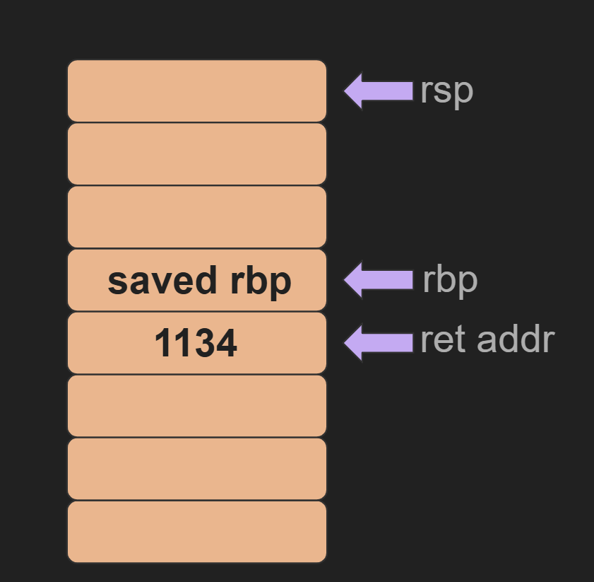
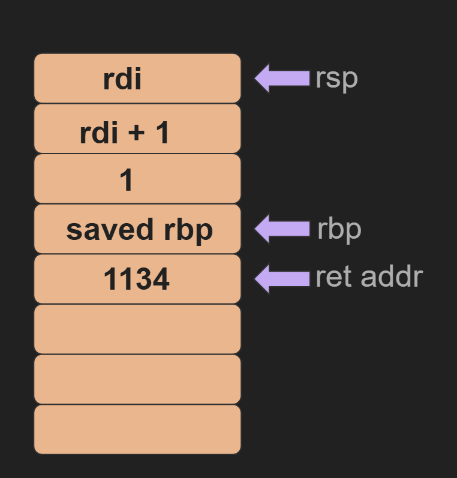
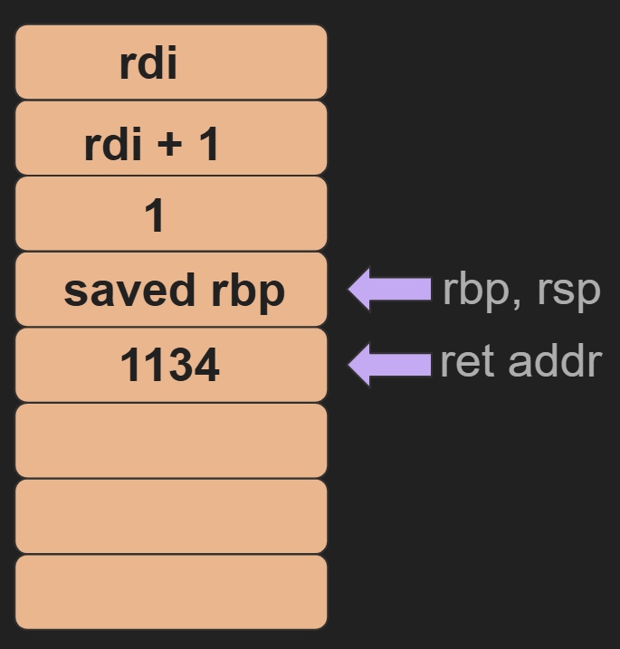
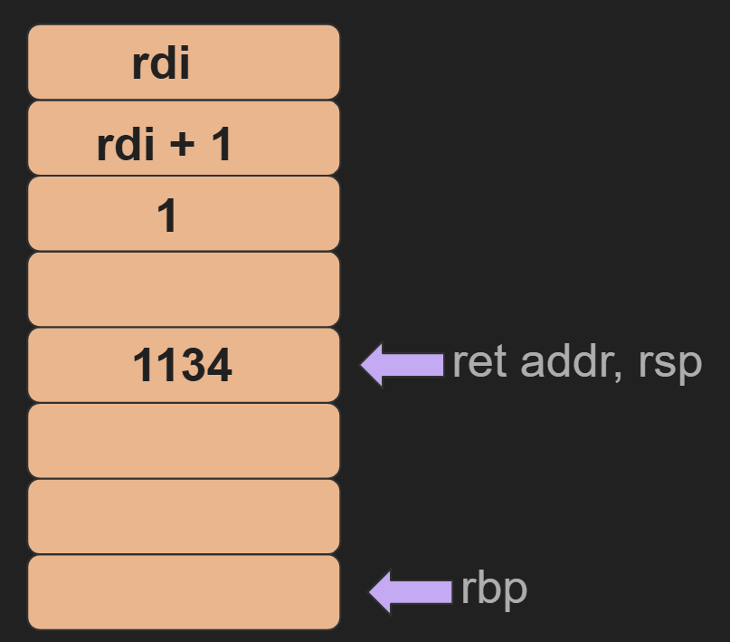
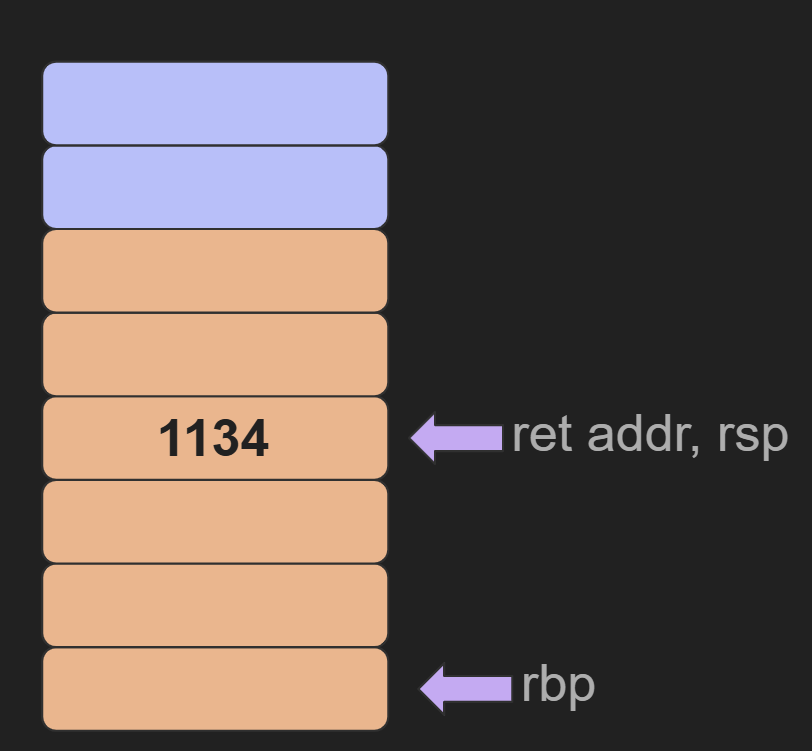

import Callout from '@/components/Callout.astro'

I recently got into studying binary exploitation mainly cause I was planning to take a course on it this semester. However due to conflicting schedules with other courses I wasn't able to take it. Oh well, anyway I made this blog post mainly as a way to test my knowledge but also to help others who wanted to get into studying pwn. I am by no means good at pwning but sometimes I feel like its better that way if I'm making a beginner friendly blog post. This blog post only assumes one thing : you know how to read C. One thing to note is that is post is strictly about x86 64 bit architecture, things will be different on different architecture. With that out of the way, let's start!

## Registers
So what are registers? Well to put it simply, a register is just a location within the processor that is used to store data, much like RAM. The difference is that registers are smaller and faster. Registers could be differentiated into two groups, general purpose registers (GPRs) and special purpose registers (SPRs). SPRs are registered that are reserved for certain tasks while GPRs can be used for any task but some of them have some special purposes for functions. In 64 bit architecutre, a register is 64 bit (8 bytes) in size. To make it clear here is a table of all the registers

### SPRs
| Register | Purpose |
| ----------|------------------|
| `rip` | points to the address of the next instruction to execute |
| `rsp` | points to the bottom of the stack frame|

### GPRs


> "-" means no conventional purpose

| Register | Convential Purpose |
|----|----|
| `rax` | return value |
| `rbx` | - |
| `rdi` | 1st integer/pointer argument|
| `rsi` | 2nd integer/pointer argument|
| `rdx` | 3rd integer/pointer argument|
| `rcx` | 4th integer/pointer argument|
| `r8` | 5th integer/pointer argument|
| `r9` | 6th integer/pointer argument|
| `r10 - r15` | - |
|`rbp`| points to the top of the stack frame |

<Callout showVariant={false} title="Fun Fact">
Although in 64 bit arch a register is 64 bit in size, we are able to reference difference sizes. For example, the lower 32 bit of the `rax` register can be referenced by `eax`. I won't go into too much for this topic, you could google around if you're interested
</Callout>

## Stack

A stack is simply a region in memory. Similar to the stack data structure, we have 2 operations we can do on the stack, push and pop. Push will push something into the stack and pop will pop something off from the stack. And in case you don't know, a stack has LIFO (last in first out) property. Imagine a stack of books, the last book you add to the stack will be the first book you take off. 

There are two main registers that are used for the stack, `rsp` and `rbp`. If you look back at the table above, `rbp` points to the top of the stack frame and `rsp` points to the bottom (if you're confused what a stack frame is, don't worry we'll get into that soon). Whever we push to the stack `rsp` decreases by 8 while when we pop the opposite happens. You might be wondering why pushing the stack decreases `rsp` instead of increasing it. This is because the stack actually grows into region of lower memory. 

The stack has many purposes but for this post we'll focus on how the stack is used to manage function calls and local variables.

To help us, we'll use the following c program

```c 
#include <stdio.h>

int inc(long number) {
    long incrementer = 1;
    long result = number + incrementer;
    return result;
}

int main() {
    inc(5);
    return 0;
}
```

The best way to understand how functions use the stack is to view the diassembly of the function. We can use `objdump` to easily do that

```ansi collapse={1-95,119-130}

test_program:     file format elf64-x86-64


Disassembly of section .init:

0000000000001000 <_init>:
    1000:	    f3 0f 1e fa          	endbr64
    1004:	    48 83 ec 08          	sub    rsp,0x8
    1008:	    48 8b 05 c1 2f 00 00 	mov    rax,QWORD PTR [rip+0x2fc1]        # 3fd0 <__gmon_start__@Base>
    100f:	    48 85 c0             	test   rax,rax
    1012:	/-- 74 02                	je     1016 <_init+0x16>
    1014:	|   ff d0                	call   rax
    1016:	\-> 48 83 c4 08          	add    rsp,0x8
    101a:	    c3                   	ret

Disassembly of section .plt:

0000000000001020 <.plt>:
    1020:	ff 35 ca 2f 00 00    	push   QWORD PTR [rip+0x2fca]        # 3ff0 <_GLOBAL_OFFSET_TABLE_+0x8>
    1026:	ff 25 cc 2f 00 00    	jmp    QWORD PTR [rip+0x2fcc]        # 3ff8 <_GLOBAL_OFFSET_TABLE_+0x10>
    102c:	0f 1f 40 00          	nop    DWORD PTR [rax+0x0]

Disassembly of section .plt.got:

0000000000001030 <__cxa_finalize@plt>:
    1030:	ff 25 aa 2f 00 00    	jmp    QWORD PTR [rip+0x2faa]        # 3fe0 <__cxa_finalize@GLIBC_2.2.5>
    1036:	66 90                	xchg   ax,ax

Disassembly of section .text:

0000000000001040 <_start>:
    1040:	f3 0f 1e fa          	endbr64
    1044:	31 ed                	xor    ebp,ebp
    1046:	49 89 d1             	mov    r9,rdx
    1049:	5e                   	pop    rsi
    104a:	48 89 e2             	mov    rdx,rsp
    104d:	48 83 e4 f0          	and    rsp,0xfffffffffffffff0
    1051:	50                   	push   rax
    1052:	54                   	push   rsp
    1053:	45 31 c0             	xor    r8d,r8d
    1056:	31 c9                	xor    ecx,ecx
    1058:	48 8d 3d c7 00 00 00 	lea    rdi,[rip+0xc7]        # 1126 <main>
    105f:	ff 15 5b 2f 00 00    	call   QWORD PTR [rip+0x2f5b]        # 3fc0 <__libc_start_main@GLIBC_2.34>
    1065:	f4                   	hlt

0000000000001066 <deregister_tm_clones>:
    1066:	    48 8d 3d a3 2f 00 00 	lea    rdi,[rip+0x2fa3]        # 4010 <__TMC_END__>
    106d:	    48 8d 05 9c 2f 00 00 	lea    rax,[rip+0x2f9c]        # 4010 <__TMC_END__>
    1074:	    48 39 f8             	cmp    rax,rdi
    1077:	/-- 74 0e                	je     1087 <deregister_tm_clones+0x21>
    1079:	|   48 8b 05 48 2f 00 00 	mov    rax,QWORD PTR [rip+0x2f48]        # 3fc8 <_ITM_deregisterTMCloneTable@Base>
    1080:	|   48 85 c0             	test   rax,rax
    1083:	+-- 74 02                	je     1087 <deregister_tm_clones+0x21>
    1085:	|   ff e0                	jmp    rax
    1087:	\-> c3                   	ret

0000000000001088 <register_tm_clones>:
    1088:	    48 8d 3d 81 2f 00 00 	lea    rdi,[rip+0x2f81]        # 4010 <__TMC_END__>
    108f:	    48 8d 35 7a 2f 00 00 	lea    rsi,[rip+0x2f7a]        # 4010 <__TMC_END__>
    1096:	    b9 02 00 00 00       	mov    ecx,0x2
    109b:	    48 29 fe             	sub    rsi,rdi
    109e:	    48 c1 fe 03          	sar    rsi,0x3
    10a2:	    48 89 f0             	mov    rax,rsi
    10a5:	    48 99                	cqo
    10a7:	    48 f7 f9             	idiv   rcx
    10aa:	    48 89 c6             	mov    rsi,rax
    10ad:	    48 85 c0             	test   rax,rax
    10b0:	/-- 74 0e                	je     10c0 <register_tm_clones+0x38>
    10b2:	|   48 8b 05 1f 2f 00 00 	mov    rax,QWORD PTR [rip+0x2f1f]        # 3fd8 <_ITM_registerTMCloneTable@Base>
    10b9:	|   48 85 c0             	test   rax,rax
    10bc:	+-- 74 02                	je     10c0 <register_tm_clones+0x38>
    10be:	|   ff e0                	jmp    rax
    10c0:	\-> c3                   	ret

00000000000010c1 <__do_global_dtors_aux>:
    10c1:	       f3 0f 1e fa          	endbr64
    10c5:	       80 3d 44 2f 00 00 00 	cmp    BYTE PTR [rip+0x2f44],0x0        # 4010 <__TMC_END__>
    10cc:	/----- 75 28                	jne    10f6 <__do_global_dtors_aux+0x35>
    10ce:	|      55                   	push   rbp
    10cf:	|      48 83 3d 09 2f 00 00 	cmp    QWORD PTR [rip+0x2f09],0x0        # 3fe0 <__cxa_finalize@GLIBC_2.2.5>
    10d6:	|      00 
    10d7:	|      48 89 e5             	mov    rbp,rsp
    10da:	|  /-- 74 0c                	je     10e8 <__do_global_dtors_aux+0x27>
    10dc:	|  |   48 8b 3d 25 2f 00 00 	mov    rdi,QWORD PTR [rip+0x2f25]        # 4008 <__dso_handle>
    10e3:	|  |   e8 48 ff ff ff       	call   1030 <__cxa_finalize@plt>
    10e8:	|  \-> e8 79 ff ff ff       	call   1066 <deregister_tm_clones>
    10ed:	|      c6 05 1c 2f 00 00 01 	mov    BYTE PTR [rip+0x2f1c],0x1        # 4010 <__TMC_END__>
    10f4:	|      5d                   	pop    rbp
    10f5:	|      c3                   	ret
    10f6:	\----> c3                   	ret

00000000000010f7 <frame_dummy>:
    10f7:	f3 0f 1e fa          	endbr64
    10fb:	eb 8b                	jmp    1088 <register_tm_clones>

00000000000010fd <inc>:
    10fd:	55                   	push   rbp
    10fe:	48 89 e5             	mov    rbp,rsp
    1101:	48 83 ec 18          	sub    rsp,0x18
    1105:	48 89 7d e8          	mov    QWORD PTR [rbp-0x18],rdi
    1109:	48 c7 45 f8 01 00 00 	mov    QWORD PTR [rbp-0x8],0x1
    1110:	00 
    1111:	48 8b 55 e8          	mov    rdx,QWORD PTR [rbp-0x18]
    1115:	48 8b 45 f8          	mov    rax,QWORD PTR [rbp-0x8]
    1119:	48 01 d0             	add    rax,rdx
    111c:	48 89 45 f0          	mov    QWORD PTR [rbp-0x10],rax
    1120:	48 8b 45 f0          	mov    rax,QWORD PTR [rbp-0x10]
    1124:	c9                   	leave
    1125:	c3                   	ret

0000000000001126 <main>:
    1126:	55                   	push   rbp
    1127:	48 89 e5             	mov    rbp,rsp
    112a:	bf 05 00 00 00       	mov    edi,0x5
    112f:	e8 c9 ff ff ff       	call   10fd <inc>
    1134:	b8 00 00 00 00       	mov    eax,0x0
    1139:	5d                   	pop    rbp
    113a:	c3                   	ret

Disassembly of section .fini:

000000000000113c <_fini>:
    113c:	f3 0f 1e fa          	endbr64
    1140:	48 83 ec 08          	sub    rsp,0x8
    1144:	48 83 c4 08          	add    rsp,0x8
    1148:	c3                   	ret
```

<Callout showVariant={false} title="Fun Fact">

In order to make this example work, I had to compile the program using the `-mno-red-zone` tag. This is because on modern Linux ABI there is something called the "red zone". You could learn more about that [here](https://en.wikipedia.org/wiki/Red_zone_(computing))
</Callout>

### Stack Frame

As I mentioned earlier, functions use the stack for a lot of things but the one we'll focus on here is local variables. Each function will have its own dedicated stack frame. That means that all local variables, buffer, and etc will reside in that stack frame. Every function could be generally seperated into 3 parts, the prolouge, function body, and epilogue. On the prolouge the function would setup its stack grame, on the function body it will does whatever the function does, and on the epilouge it will tear down its stack pointer.


```ansi collapse={1-95,121-130} {"Prolouge": 97-100} {"Epilouge": 109-111}

test_program:     file format elf64-x86-64


Disassembly of section .init:

0000000000001000 <_init>:
    1000:	    f3 0f 1e fa          	endbr64
    1004:	    48 83 ec 08          	sub    rsp,0x8
    1008:	    48 8b 05 c1 2f 00 00 	mov    rax,QWORD PTR [rip+0x2fc1]        # 3fd0 <__gmon_start__@Base>
    100f:	    48 85 c0             	test   rax,rax
    1012:	/-- 74 02                	je     1016 <_init+0x16>
    1014:	|   ff d0                	call   rax
    1016:	\-> 48 83 c4 08          	add    rsp,0x8
    101a:	    c3                   	ret

Disassembly of section .plt:

0000000000001020 <.plt>:
    1020:	ff 35 ca 2f 00 00    	push   QWORD PTR [rip+0x2fca]        # 3ff0 <_GLOBAL_OFFSET_TABLE_+0x8>
    1026:	ff 25 cc 2f 00 00    	jmp    QWORD PTR [rip+0x2fcc]        # 3ff8 <_GLOBAL_OFFSET_TABLE_+0x10>
    102c:	0f 1f 40 00          	nop    DWORD PTR [rax+0x0]

Disassembly of section .plt.got:

0000000000001030 <__cxa_finalize@plt>:
    1030:	ff 25 aa 2f 00 00    	jmp    QWORD PTR [rip+0x2faa]        # 3fe0 <__cxa_finalize@GLIBC_2.2.5>
    1036:	66 90                	xchg   ax,ax

Disassembly of section .text:

0000000000001040 <_start>:
    1040:	f3 0f 1e fa          	endbr64
    1044:	31 ed                	xor    ebp,ebp
    1046:	49 89 d1             	mov    r9,rdx
    1049:	5e                   	pop    rsi
    104a:	48 89 e2             	mov    rdx,rsp
    104d:	48 83 e4 f0          	and    rsp,0xfffffffffffffff0
    1051:	50                   	push   rax
    1052:	54                   	push   rsp
    1053:	45 31 c0             	xor    r8d,r8d
    1056:	31 c9                	xor    ecx,ecx
    1058:	48 8d 3d c7 00 00 00 	lea    rdi,[rip+0xc7]        # 1126 <main>
    105f:	ff 15 5b 2f 00 00    	call   QWORD PTR [rip+0x2f5b]        # 3fc0 <__libc_start_main@GLIBC_2.34>
    1065:	f4                   	hlt

0000000000001066 <deregister_tm_clones>:
    1066:	    48 8d 3d a3 2f 00 00 	lea    rdi,[rip+0x2fa3]        # 4010 <__TMC_END__>
    106d:	    48 8d 05 9c 2f 00 00 	lea    rax,[rip+0x2f9c]        # 4010 <__TMC_END__>
    1074:	    48 39 f8             	cmp    rax,rdi
    1077:	/-- 74 0e                	je     1087 <deregister_tm_clones+0x21>
    1079:	|   48 8b 05 48 2f 00 00 	mov    rax,QWORD PTR [rip+0x2f48]        # 3fc8 <_ITM_deregisterTMCloneTable@Base>
    1080:	|   48 85 c0             	test   rax,rax
    1083:	+-- 74 02                	je     1087 <deregister_tm_clones+0x21>
    1085:	|   ff e0                	jmp    rax
    1087:	\-> c3                   	ret

0000000000001088 <register_tm_clones>:
    1088:	    48 8d 3d 81 2f 00 00 	lea    rdi,[rip+0x2f81]        # 4010 <__TMC_END__>
    108f:	    48 8d 35 7a 2f 00 00 	lea    rsi,[rip+0x2f7a]        # 4010 <__TMC_END__>
    1096:	    b9 02 00 00 00       	mov    ecx,0x2
    109b:	    48 29 fe             	sub    rsi,rdi
    109e:	    48 c1 fe 03          	sar    rsi,0x3
    10a2:	    48 89 f0             	mov    rax,rsi
    10a5:	    48 99                	cqo
    10a7:	    48 f7 f9             	idiv   rcx
    10aa:	    48 89 c6             	mov    rsi,rax
    10ad:	    48 85 c0             	test   rax,rax
    10b0:	/-- 74 0e                	je     10c0 <register_tm_clones+0x38>
    10b2:	|   48 8b 05 1f 2f 00 00 	mov    rax,QWORD PTR [rip+0x2f1f]        # 3fd8 <_ITM_registerTMCloneTable@Base>
    10b9:	|   48 85 c0             	test   rax,rax
    10bc:	+-- 74 02                	je     10c0 <register_tm_clones+0x38>
    10be:	|   ff e0                	jmp    rax
    10c0:	\-> c3                   	ret

00000000000010c1 <__do_global_dtors_aux>:
    10c1:	       f3 0f 1e fa          	endbr64
    10c5:	       80 3d 44 2f 00 00 00 	cmp    BYTE PTR [rip+0x2f44],0x0        # 4010 <__TMC_END__>
    10cc:	/----- 75 28                	jne    10f6 <__do_global_dtors_aux+0x35>
    10ce:	|      55                   	push   rbp
    10cf:	|      48 83 3d 09 2f 00 00 	cmp    QWORD PTR [rip+0x2f09],0x0        # 3fe0 <__cxa_finalize@GLIBC_2.2.5>
    10d6:	|      00 
    10d7:	|      48 89 e5             	mov    rbp,rsp
    10da:	|  /-- 74 0c                	je     10e8 <__do_global_dtors_aux+0x27>
    10dc:	|  |   48 8b 3d 25 2f 00 00 	mov    rdi,QWORD PTR [rip+0x2f25]        # 4008 <__dso_handle>
    10e3:	|  |   e8 48 ff ff ff       	call   1030 <__cxa_finalize@plt>
    10e8:	|  \-> e8 79 ff ff ff       	call   1066 <deregister_tm_clones>
    10ed:	|      c6 05 1c 2f 00 00 01 	mov    BYTE PTR [rip+0x2f1c],0x1        # 4010 <__TMC_END__>
    10f4:	|      5d                   	pop    rbp
    10f5:	|      c3                   	ret
    10f6:	\----> c3                   	ret

00000000000010f7 <frame_dummy>:
    10f7:	f3 0f 1e fa          	endbr64
    10fb:	eb 8b                	jmp    1088 <register_tm_clones>

00000000000010fd <inc>:

    10fd:	55                   	push   rbp
    10fe:	48 89 e5             	mov    rbp,rsp
    1101:	48 83 ec 18          	sub    rsp,0x18
    1105:	48 89 7d e8          	mov    QWORD PTR [rbp-0x18],rdi
    1109:	48 c7 45 f8 01 00 00 	mov    QWORD PTR [rbp-0x8],0x1
    1110:	00 
    1111:	48 8b 55 e8          	mov    rdx,QWORD PTR [rbp-0x18]
    1115:	48 8b 45 f8          	mov    rax,QWORD PTR [rbp-0x8]
    1119:	48 01 d0             	add    rax,rdx
    111c:	48 89 45 f0          	mov    QWORD PTR [rbp-0x10],rax
    1120:	48 8b 45 f0          	mov    rax,QWORD PTR [rbp-0x10]

    1124:	c9                   	leave
    1125:	c3                   	ret

0000000000001126 <main>:
    1126:	55                   	push   rbp
    1127:	48 89 e5             	mov    rbp,rsp
    112a:	bf 05 00 00 00       	mov    edi,0x5
    112f:	e8 c9 ff ff ff       	call   10fd <inc>
    1134:	b8 00 00 00 00       	mov    eax,0x0
    1139:	5d                   	pop    rbp
    113a:	c3                   	ret

Disassembly of section .fini:

000000000000113c <_fini>:
    113c:	f3 0f 1e fa          	endbr64
    1140:	48 83 ec 08          	sub    rsp,0x8
    1144:	48 83 c4 08          	add    rsp,0x8
    1148:	c3                   	ret
```


### Calling Functions
So what happens when we call a function? Let's take a look at the `call` instruction on `main`

```ansi collapse={1-112,121-130} {117}

test_program:     file format elf64-x86-64


Disassembly of section .init:

0000000000001000 <_init>:
    1000:	    f3 0f 1e fa          	endbr64
    1004:	    48 83 ec 08          	sub    rsp,0x8
    1008:	    48 8b 05 c1 2f 00 00 	mov    rax,QWORD PTR [rip+0x2fc1]        # 3fd0 <__gmon_start__@Base>
    100f:	    48 85 c0             	test   rax,rax
    1012:	/-- 74 02                	je     1016 <_init+0x16>
    1014:	|   ff d0                	call   rax
    1016:	\-> 48 83 c4 08          	add    rsp,0x8
    101a:	    c3                   	ret

Disassembly of section .plt:

0000000000001020 <.plt>:
    1020:	ff 35 ca 2f 00 00    	push   QWORD PTR [rip+0x2fca]        # 3ff0 <_GLOBAL_OFFSET_TABLE_+0x8>
    1026:	ff 25 cc 2f 00 00    	jmp    QWORD PTR [rip+0x2fcc]        # 3ff8 <_GLOBAL_OFFSET_TABLE_+0x10>
    102c:	0f 1f 40 00          	nop    DWORD PTR [rax+0x0]

Disassembly of section .plt.got:

0000000000001030 <__cxa_finalize@plt>:
    1030:	ff 25 aa 2f 00 00    	jmp    QWORD PTR [rip+0x2faa]        # 3fe0 <__cxa_finalize@GLIBC_2.2.5>
    1036:	66 90                	xchg   ax,ax

Disassembly of section .text:

0000000000001040 <_start>:
    1040:	f3 0f 1e fa          	endbr64
    1044:	31 ed                	xor    ebp,ebp
    1046:	49 89 d1             	mov    r9,rdx
    1049:	5e                   	pop    rsi
    104a:	48 89 e2             	mov    rdx,rsp
    104d:	48 83 e4 f0          	and    rsp,0xfffffffffffffff0
    1051:	50                   	push   rax
    1052:	54                   	push   rsp
    1053:	45 31 c0             	xor    r8d,r8d
    1056:	31 c9                	xor    ecx,ecx
    1058:	48 8d 3d c7 00 00 00 	lea    rdi,[rip+0xc7]        # 1126 <main>
    105f:	ff 15 5b 2f 00 00    	call   QWORD PTR [rip+0x2f5b]        # 3fc0 <__libc_start_main@GLIBC_2.34>
    1065:	f4                   	hlt

0000000000001066 <deregister_tm_clones>:
    1066:	    48 8d 3d a3 2f 00 00 	lea    rdi,[rip+0x2fa3]        # 4010 <__TMC_END__>
    106d:	    48 8d 05 9c 2f 00 00 	lea    rax,[rip+0x2f9c]        # 4010 <__TMC_END__>
    1074:	    48 39 f8             	cmp    rax,rdi
    1077:	/-- 74 0e                	je     1087 <deregister_tm_clones+0x21>
    1079:	|   48 8b 05 48 2f 00 00 	mov    rax,QWORD PTR [rip+0x2f48]        # 3fc8 <_ITM_deregisterTMCloneTable@Base>
    1080:	|   48 85 c0             	test   rax,rax
    1083:	+-- 74 02                	je     1087 <deregister_tm_clones+0x21>
    1085:	|   ff e0                	jmp    rax
    1087:	\-> c3                   	ret

0000000000001088 <register_tm_clones>:
    1088:	    48 8d 3d 81 2f 00 00 	lea    rdi,[rip+0x2f81]        # 4010 <__TMC_END__>
    108f:	    48 8d 35 7a 2f 00 00 	lea    rsi,[rip+0x2f7a]        # 4010 <__TMC_END__>
    1096:	    b9 02 00 00 00       	mov    ecx,0x2
    109b:	    48 29 fe             	sub    rsi,rdi
    109e:	    48 c1 fe 03          	sar    rsi,0x3
    10a2:	    48 89 f0             	mov    rax,rsi
    10a5:	    48 99                	cqo
    10a7:	    48 f7 f9             	idiv   rcx
    10aa:	    48 89 c6             	mov    rsi,rax
    10ad:	    48 85 c0             	test   rax,rax
    10b0:	/-- 74 0e                	je     10c0 <register_tm_clones+0x38>
    10b2:	|   48 8b 05 1f 2f 00 00 	mov    rax,QWORD PTR [rip+0x2f1f]        # 3fd8 <_ITM_registerTMCloneTable@Base>
    10b9:	|   48 85 c0             	test   rax,rax
    10bc:	+-- 74 02                	je     10c0 <register_tm_clones+0x38>
    10be:	|   ff e0                	jmp    rax
    10c0:	\-> c3                   	ret

00000000000010c1 <__do_global_dtors_aux>:
    10c1:	       f3 0f 1e fa          	endbr64
    10c5:	       80 3d 44 2f 00 00 00 	cmp    BYTE PTR [rip+0x2f44],0x0        # 4010 <__TMC_END__>
    10cc:	/----- 75 28                	jne    10f6 <__do_global_dtors_aux+0x35>
    10ce:	|      55                   	push   rbp
    10cf:	|      48 83 3d 09 2f 00 00 	cmp    QWORD PTR [rip+0x2f09],0x0        # 3fe0 <__cxa_finalize@GLIBC_2.2.5>
    10d6:	|      00 
    10d7:	|      48 89 e5             	mov    rbp,rsp
    10da:	|  /-- 74 0c                	je     10e8 <__do_global_dtors_aux+0x27>
    10dc:	|  |   48 8b 3d 25 2f 00 00 	mov    rdi,QWORD PTR [rip+0x2f25]        # 4008 <__dso_handle>
    10e3:	|  |   e8 48 ff ff ff       	call   1030 <__cxa_finalize@plt>
    10e8:	|  \-> e8 79 ff ff ff       	call   1066 <deregister_tm_clones>
    10ed:	|      c6 05 1c 2f 00 00 01 	mov    BYTE PTR [rip+0x2f1c],0x1        # 4010 <__TMC_END__>
    10f4:	|      5d                   	pop    rbp
    10f5:	|      c3                   	ret
    10f6:	\----> c3                   	ret

00000000000010f7 <frame_dummy>:
    10f7:	f3 0f 1e fa          	endbr64
    10fb:	eb 8b                	jmp    1088 <register_tm_clones>

00000000000010fd <inc>:

    10fd:	55                   	push   rbp
    10fe:	48 89 e5             	mov    rbp,rsp
    1101:	48 83 ec 18          	sub    rsp,0x18
    1105:	48 89 7d e8          	mov    QWORD PTR [rbp-0x18],rdi
    1109:	48 c7 45 f8 01 00 00 	mov    QWORD PTR [rbp-0x8],0x1
    1110:	00 
    1111:	48 8b 55 e8          	mov    rdx,QWORD PTR [rbp-0x18]
    1115:	48 8b 45 f8          	mov    rax,QWORD PTR [rbp-0x8]
    1119:	48 01 d0             	add    rax,rdx
    111c:	48 89 45 f0          	mov    QWORD PTR [rbp-0x10],rax
    1120:	48 8b 45 f0          	mov    rax,QWORD PTR [rbp-0x10]

    1124:	c9                   	leave
    1125:	c3                   	ret

0000000000001126 <main>:
    1126:	55                   	push   rbp
    1127:	48 89 e5             	mov    rbp,rsp
    112a:	bf 05 00 00 00       	mov    edi,0x5
    112f:	e8 c9 ff ff ff       	call   10fd <inc>
    1134:	b8 00 00 00 00       	mov    eax,0x0
    1139:	5d                   	pop    rbp
    113a:	c3                   	ret

Disassembly of section .fini:

000000000000113c <_fini>:
    113c:	f3 0f 1e fa          	endbr64
    1140:	48 83 ec 08          	sub    rsp,0x8
    1144:	48 83 c4 08          	add    rsp,0x8
    1148:	c3                   	ret
```

The call function does 2 things, first it pushes the address of the instruction after it to the stack, then it jumps to the address of the function it is calling. So in this case it will push `1134` to the stack, then jumps to `inc`. The address `1134` is called the return address because that is where the program will jump to after the `inc` function has finished executing. Visually, here is what the stack looks like after the call function


### Prolouge

After we jump to `inc` we enter the Prolouge. Let's take a look at what the Prolouge does

```ansi collapse={1-95,113-130} {"Prolouge": 97-100} 

test_program:     file format elf64-x86-64


Disassembly of section .init:

0000000000001000 <_init>:
    1000:	    f3 0f 1e fa          	endbr64
    1004:	    48 83 ec 08          	sub    rsp,0x8
    1008:	    48 8b 05 c1 2f 00 00 	mov    rax,QWORD PTR [rip+0x2fc1]        # 3fd0 <__gmon_start__@Base>
    100f:	    48 85 c0             	test   rax,rax
    1012:	/-- 74 02                	je     1016 <_init+0x16>
    1014:	|   ff d0                	call   rax
    1016:	\-> 48 83 c4 08          	add    rsp,0x8
    101a:	    c3                   	ret

Disassembly of section .plt:

0000000000001020 <.plt>:
    1020:	ff 35 ca 2f 00 00    	push   QWORD PTR [rip+0x2fca]        # 3ff0 <_GLOBAL_OFFSET_TABLE_+0x8>
    1026:	ff 25 cc 2f 00 00    	jmp    QWORD PTR [rip+0x2fcc]        # 3ff8 <_GLOBAL_OFFSET_TABLE_+0x10>
    102c:	0f 1f 40 00          	nop    DWORD PTR [rax+0x0]

Disassembly of section .plt.got:

0000000000001030 <__cxa_finalize@plt>:
    1030:	ff 25 aa 2f 00 00    	jmp    QWORD PTR [rip+0x2faa]        # 3fe0 <__cxa_finalize@GLIBC_2.2.5>
    1036:	66 90                	xchg   ax,ax

Disassembly of section .text:

0000000000001040 <_start>:
    1040:	f3 0f 1e fa          	endbr64
    1044:	31 ed                	xor    ebp,ebp
    1046:	49 89 d1             	mov    r9,rdx
    1049:	5e                   	pop    rsi
    104a:	48 89 e2             	mov    rdx,rsp
    104d:	48 83 e4 f0          	and    rsp,0xfffffffffffffff0
    1051:	50                   	push   rax
    1052:	54                   	push   rsp
    1053:	45 31 c0             	xor    r8d,r8d
    1056:	31 c9                	xor    ecx,ecx
    1058:	48 8d 3d c7 00 00 00 	lea    rdi,[rip+0xc7]        # 1126 <main>
    105f:	ff 15 5b 2f 00 00    	call   QWORD PTR [rip+0x2f5b]        # 3fc0 <__libc_start_main@GLIBC_2.34>
    1065:	f4                   	hlt

0000000000001066 <deregister_tm_clones>:
    1066:	    48 8d 3d a3 2f 00 00 	lea    rdi,[rip+0x2fa3]        # 4010 <__TMC_END__>
    106d:	    48 8d 05 9c 2f 00 00 	lea    rax,[rip+0x2f9c]        # 4010 <__TMC_END__>
    1074:	    48 39 f8             	cmp    rax,rdi
    1077:	/-- 74 0e                	je     1087 <deregister_tm_clones+0x21>
    1079:	|   48 8b 05 48 2f 00 00 	mov    rax,QWORD PTR [rip+0x2f48]        # 3fc8 <_ITM_deregisterTMCloneTable@Base>
    1080:	|   48 85 c0             	test   rax,rax
    1083:	+-- 74 02                	je     1087 <deregister_tm_clones+0x21>
    1085:	|   ff e0                	jmp    rax
    1087:	\-> c3                   	ret

0000000000001088 <register_tm_clones>:
    1088:	    48 8d 3d 81 2f 00 00 	lea    rdi,[rip+0x2f81]        # 4010 <__TMC_END__>
    108f:	    48 8d 35 7a 2f 00 00 	lea    rsi,[rip+0x2f7a]        # 4010 <__TMC_END__>
    1096:	    b9 02 00 00 00       	mov    ecx,0x2
    109b:	    48 29 fe             	sub    rsi,rdi
    109e:	    48 c1 fe 03          	sar    rsi,0x3
    10a2:	    48 89 f0             	mov    rax,rsi
    10a5:	    48 99                	cqo
    10a7:	    48 f7 f9             	idiv   rcx
    10aa:	    48 89 c6             	mov    rsi,rax
    10ad:	    48 85 c0             	test   rax,rax
    10b0:	/-- 74 0e                	je     10c0 <register_tm_clones+0x38>
    10b2:	|   48 8b 05 1f 2f 00 00 	mov    rax,QWORD PTR [rip+0x2f1f]        # 3fd8 <_ITM_registerTMCloneTable@Base>
    10b9:	|   48 85 c0             	test   rax,rax
    10bc:	+-- 74 02                	je     10c0 <register_tm_clones+0x38>
    10be:	|   ff e0                	jmp    rax
    10c0:	\-> c3                   	ret

00000000000010c1 <__do_global_dtors_aux>:
    10c1:	       f3 0f 1e fa          	endbr64
    10c5:	       80 3d 44 2f 00 00 00 	cmp    BYTE PTR [rip+0x2f44],0x0        # 4010 <__TMC_END__>
    10cc:	/----- 75 28                	jne    10f6 <__do_global_dtors_aux+0x35>
    10ce:	|      55                   	push   rbp
    10cf:	|      48 83 3d 09 2f 00 00 	cmp    QWORD PTR [rip+0x2f09],0x0        # 3fe0 <__cxa_finalize@GLIBC_2.2.5>
    10d6:	|      00 
    10d7:	|      48 89 e5             	mov    rbp,rsp
    10da:	|  /-- 74 0c                	je     10e8 <__do_global_dtors_aux+0x27>
    10dc:	|  |   48 8b 3d 25 2f 00 00 	mov    rdi,QWORD PTR [rip+0x2f25]        # 4008 <__dso_handle>
    10e3:	|  |   e8 48 ff ff ff       	call   1030 <__cxa_finalize@plt>
    10e8:	|  \-> e8 79 ff ff ff       	call   1066 <deregister_tm_clones>
    10ed:	|      c6 05 1c 2f 00 00 01 	mov    BYTE PTR [rip+0x2f1c],0x1        # 4010 <__TMC_END__>
    10f4:	|      5d                   	pop    rbp
    10f5:	|      c3                   	ret
    10f6:	\----> c3                   	ret

00000000000010f7 <frame_dummy>:
    10f7:	f3 0f 1e fa          	endbr64
    10fb:	eb 8b                	jmp    1088 <register_tm_clones>

00000000000010fd <inc>:

    10fd:	55                   	push   rbp
    10fe:	48 89 e5             	mov    rbp,rsp
    1101:	48 83 ec 18          	sub    rsp,0x18
    1105:	48 89 7d e8          	mov    QWORD PTR [rbp-0x18],rdi
    1109:	48 c7 45 f8 01 00 00 	mov    QWORD PTR [rbp-0x8],0x1
    1110:	00 
    1111:	48 8b 55 e8          	mov    rdx,QWORD PTR [rbp-0x18]
    1115:	48 8b 45 f8          	mov    rax,QWORD PTR [rbp-0x8]
    1119:	48 01 d0             	add    rax,rdx
    111c:	48 89 45 f0          	mov    QWORD PTR [rbp-0x10],rax
    1120:	48 8b 45 f0          	mov    rax,QWORD PTR [rbp-0x10]

    1124:	c9                   	leave
    1125:	c3                   	ret

0000000000001126 <main>:
    1126:	55                   	push   rbp
    1127:	48 89 e5             	mov    rbp,rsp
    112a:	bf 05 00 00 00       	mov    edi,0x5
    112f:	e8 c9 ff ff ff       	call   10fd <inc>
    1134:	b8 00 00 00 00       	mov    eax,0x0
    1139:	5d                   	pop    rbp
    113a:	c3                   	ret

Disassembly of section .fini:

000000000000113c <_fini>:
    113c:	f3 0f 1e fa          	endbr64
    1140:	48 83 ec 08          	sub    rsp,0x8
    1144:	48 83 c4 08          	add    rsp,0x8
    1148:	c3                   	ret
```

First of all, we push `rbp`. We do this so that we could save the rbp of the caller function, in this case `main`. Next we move rsp to rbp, this sets the top to `main`'s stack frame to the bottom of `inc`'s stack frame. After that we subtract `rsp` by `0x18` to make some space. After the prolouge, here is what the stack looks like



The space between `rbp` and `rsp` is `inc`'s stack frame

### Body

Next we enter the function's main body. 

```ansi collapse={1-95,113-130} {"Body": 101-108} 

test_program:     file format elf64-x86-64


Disassembly of section .init:

0000000000001000 <_init>:
    1000:	    f3 0f 1e fa          	endbr64
    1004:	    48 83 ec 08          	sub    rsp,0x8
    1008:	    48 8b 05 c1 2f 00 00 	mov    rax,QWORD PTR [rip+0x2fc1]        # 3fd0 <__gmon_start__@Base>
    100f:	    48 85 c0             	test   rax,rax
    1012:	/-- 74 02                	je     1016 <_init+0x16>
    1014:	|   ff d0                	call   rax
    1016:	\-> 48 83 c4 08          	add    rsp,0x8
    101a:	    c3                   	ret

Disassembly of section .plt:

0000000000001020 <.plt>:
    1020:	ff 35 ca 2f 00 00    	push   QWORD PTR [rip+0x2fca]        # 3ff0 <_GLOBAL_OFFSET_TABLE_+0x8>
    1026:	ff 25 cc 2f 00 00    	jmp    QWORD PTR [rip+0x2fcc]        # 3ff8 <_GLOBAL_OFFSET_TABLE_+0x10>
    102c:	0f 1f 40 00          	nop    DWORD PTR [rax+0x0]

Disassembly of section .plt.got:

0000000000001030 <__cxa_finalize@plt>:
    1030:	ff 25 aa 2f 00 00    	jmp    QWORD PTR [rip+0x2faa]        # 3fe0 <__cxa_finalize@GLIBC_2.2.5>
    1036:	66 90                	xchg   ax,ax

Disassembly of section .text:

0000000000001040 <_start>:
    1040:	f3 0f 1e fa          	endbr64
    1044:	31 ed                	xor    ebp,ebp
    1046:	49 89 d1             	mov    r9,rdx
    1049:	5e                   	pop    rsi
    104a:	48 89 e2             	mov    rdx,rsp
    104d:	48 83 e4 f0          	and    rsp,0xfffffffffffffff0
    1051:	50                   	push   rax
    1052:	54                   	push   rsp
    1053:	45 31 c0             	xor    r8d,r8d
    1056:	31 c9                	xor    ecx,ecx
    1058:	48 8d 3d c7 00 00 00 	lea    rdi,[rip+0xc7]        # 1126 <main>
    105f:	ff 15 5b 2f 00 00    	call   QWORD PTR [rip+0x2f5b]        # 3fc0 <__libc_start_main@GLIBC_2.34>
    1065:	f4                   	hlt

0000000000001066 <deregister_tm_clones>:
    1066:	    48 8d 3d a3 2f 00 00 	lea    rdi,[rip+0x2fa3]        # 4010 <__TMC_END__>
    106d:	    48 8d 05 9c 2f 00 00 	lea    rax,[rip+0x2f9c]        # 4010 <__TMC_END__>
    1074:	    48 39 f8             	cmp    rax,rdi
    1077:	/-- 74 0e                	je     1087 <deregister_tm_clones+0x21>
    1079:	|   48 8b 05 48 2f 00 00 	mov    rax,QWORD PTR [rip+0x2f48]        # 3fc8 <_ITM_deregisterTMCloneTable@Base>
    1080:	|   48 85 c0             	test   rax,rax
    1083:	+-- 74 02                	je     1087 <deregister_tm_clones+0x21>
    1085:	|   ff e0                	jmp    rax
    1087:	\-> c3                   	ret

0000000000001088 <register_tm_clones>:
    1088:	    48 8d 3d 81 2f 00 00 	lea    rdi,[rip+0x2f81]        # 4010 <__TMC_END__>
    108f:	    48 8d 35 7a 2f 00 00 	lea    rsi,[rip+0x2f7a]        # 4010 <__TMC_END__>
    1096:	    b9 02 00 00 00       	mov    ecx,0x2
    109b:	    48 29 fe             	sub    rsi,rdi
    109e:	    48 c1 fe 03          	sar    rsi,0x3
    10a2:	    48 89 f0             	mov    rax,rsi
    10a5:	    48 99                	cqo
    10a7:	    48 f7 f9             	idiv   rcx
    10aa:	    48 89 c6             	mov    rsi,rax
    10ad:	    48 85 c0             	test   rax,rax
    10b0:	/-- 74 0e                	je     10c0 <register_tm_clones+0x38>
    10b2:	|   48 8b 05 1f 2f 00 00 	mov    rax,QWORD PTR [rip+0x2f1f]        # 3fd8 <_ITM_registerTMCloneTable@Base>
    10b9:	|   48 85 c0             	test   rax,rax
    10bc:	+-- 74 02                	je     10c0 <register_tm_clones+0x38>
    10be:	|   ff e0                	jmp    rax
    10c0:	\-> c3                   	ret

00000000000010c1 <__do_global_dtors_aux>:
    10c1:	       f3 0f 1e fa          	endbr64
    10c5:	       80 3d 44 2f 00 00 00 	cmp    BYTE PTR [rip+0x2f44],0x0        # 4010 <__TMC_END__>
    10cc:	/----- 75 28                	jne    10f6 <__do_global_dtors_aux+0x35>
    10ce:	|      55                   	push   rbp
    10cf:	|      48 83 3d 09 2f 00 00 	cmp    QWORD PTR [rip+0x2f09],0x0        # 3fe0 <__cxa_finalize@GLIBC_2.2.5>
    10d6:	|      00 
    10d7:	|      48 89 e5             	mov    rbp,rsp
    10da:	|  /-- 74 0c                	je     10e8 <__do_global_dtors_aux+0x27>
    10dc:	|  |   48 8b 3d 25 2f 00 00 	mov    rdi,QWORD PTR [rip+0x2f25]        # 4008 <__dso_handle>
    10e3:	|  |   e8 48 ff ff ff       	call   1030 <__cxa_finalize@plt>
    10e8:	|  \-> e8 79 ff ff ff       	call   1066 <deregister_tm_clones>
    10ed:	|      c6 05 1c 2f 00 00 01 	mov    BYTE PTR [rip+0x2f1c],0x1        # 4010 <__TMC_END__>
    10f4:	|      5d                   	pop    rbp
    10f5:	|      c3                   	ret
    10f6:	\----> c3                   	ret

00000000000010f7 <frame_dummy>:
    10f7:	f3 0f 1e fa          	endbr64
    10fb:	eb 8b                	jmp    1088 <register_tm_clones>

00000000000010fd <inc>:

    10fd:	55                   	push   rbp
    10fe:	48 89 e5             	mov    rbp,rsp
    1101:	48 83 ec 18          	sub    rsp,0x18
    1105:	48 89 7d e8          	mov    QWORD PTR [rbp-0x18],rdi
    1109:	48 c7 45 f8 01 00 00 	mov    QWORD PTR [rbp-0x8],0x1
    1110:	00 
    1111:	48 8b 55 e8          	mov    rdx,QWORD PTR [rbp-0x18]
    1115:	48 8b 45 f8          	mov    rax,QWORD PTR [rbp-0x8]
    1119:	48 01 d0             	add    rax,rdx
    111c:	48 89 45 f0          	mov    QWORD PTR [rbp-0x10],rax
    1120:	48 8b 45 f0          	mov    rax,QWORD PTR [rbp-0x10]

    1124:	c9                   	leave
    1125:	c3                   	ret

0000000000001126 <main>:
    1126:	55                   	push   rbp
    1127:	48 89 e5             	mov    rbp,rsp
    112a:	bf 05 00 00 00       	mov    edi,0x5
    112f:	e8 c9 ff ff ff       	call   10fd <inc>
    1134:	b8 00 00 00 00       	mov    eax,0x0
    1139:	5d                   	pop    rbp
    113a:	c3                   	ret

Disassembly of section .fini:

000000000000113c <_fini>:
    113c:	f3 0f 1e fa          	endbr64
    1140:	48 83 ec 08          	sub    rsp,0x8
    1144:	48 83 c4 08          	add    rsp,0x8
    1148:	c3                   	ret
```

First we move `rdi` to `rbp-0x18`. If you recall, `rdi` is the register used to store the first argument in the function and `rbp-0x18` is where `rsp` is currently pointing to. Next we move 0x1 to `rbp-0x8`. Looking back at the C code, we can tell that this basiclly coresponds to the line `long incrementer = 1; {:c}`. This way we can see that indeed local variables are stored on the stack. 

I'll move pass a couple instructions quickly. We move `rbp-0x18` (`rdi`) to `rdx`, then move `rbp-0x8` (1) to `rax`, after that we add them both together then move the result into `rbp-0x10` and finally move the value inside `rbp-0x10` into `rax`.

<Callout>

1. In assembly, the add instruction uses the following format `add reg1,reg2 {:asm}`. This will add the contents of reg1 with reg2 then store the result into reg1.

2. The reason why we move the value of `rax` to `rbp-0x10` and then back to `rax` again is because `rax` is used to store the return value of a function and we can check on the C code that the function returns the result of the addition
</Callout>

After the body, here is what the stack looks like



### Epilouge

We finally reach the Epilouge of `inc`

```ansi collapse={1-95,113-130} {"Epilouge": 109-111}

test_program:     file format elf64-x86-64


Disassembly of section .init:

0000000000001000 <_init>:
    1000:	    f3 0f 1e fa          	endbr64
    1004:	    48 83 ec 08          	sub    rsp,0x8
    1008:	    48 8b 05 c1 2f 00 00 	mov    rax,QWORD PTR [rip+0x2fc1]        # 3fd0 <__gmon_start__@Base>
    100f:	    48 85 c0             	test   rax,rax
    1012:	/-- 74 02                	je     1016 <_init+0x16>
    1014:	|   ff d0                	call   rax
    1016:	\-> 48 83 c4 08          	add    rsp,0x8
    101a:	    c3                   	ret

Disassembly of section .plt:

0000000000001020 <.plt>:
    1020:	ff 35 ca 2f 00 00    	push   QWORD PTR [rip+0x2fca]        # 3ff0 <_GLOBAL_OFFSET_TABLE_+0x8>
    1026:	ff 25 cc 2f 00 00    	jmp    QWORD PTR [rip+0x2fcc]        # 3ff8 <_GLOBAL_OFFSET_TABLE_+0x10>
    102c:	0f 1f 40 00          	nop    DWORD PTR [rax+0x0]

Disassembly of section .plt.got:

0000000000001030 <__cxa_finalize@plt>:
    1030:	ff 25 aa 2f 00 00    	jmp    QWORD PTR [rip+0x2faa]        # 3fe0 <__cxa_finalize@GLIBC_2.2.5>
    1036:	66 90                	xchg   ax,ax

Disassembly of section .text:

0000000000001040 <_start>:
    1040:	f3 0f 1e fa          	endbr64
    1044:	31 ed                	xor    ebp,ebp
    1046:	49 89 d1             	mov    r9,rdx
    1049:	5e                   	pop    rsi
    104a:	48 89 e2             	mov    rdx,rsp
    104d:	48 83 e4 f0          	and    rsp,0xfffffffffffffff0
    1051:	50                   	push   rax
    1052:	54                   	push   rsp
    1053:	45 31 c0             	xor    r8d,r8d
    1056:	31 c9                	xor    ecx,ecx
    1058:	48 8d 3d c7 00 00 00 	lea    rdi,[rip+0xc7]        # 1126 <main>
    105f:	ff 15 5b 2f 00 00    	call   QWORD PTR [rip+0x2f5b]        # 3fc0 <__libc_start_main@GLIBC_2.34>
    1065:	f4                   	hlt

0000000000001066 <deregister_tm_clones>:
    1066:	    48 8d 3d a3 2f 00 00 	lea    rdi,[rip+0x2fa3]        # 4010 <__TMC_END__>
    106d:	    48 8d 05 9c 2f 00 00 	lea    rax,[rip+0x2f9c]        # 4010 <__TMC_END__>
    1074:	    48 39 f8             	cmp    rax,rdi
    1077:	/-- 74 0e                	je     1087 <deregister_tm_clones+0x21>
    1079:	|   48 8b 05 48 2f 00 00 	mov    rax,QWORD PTR [rip+0x2f48]        # 3fc8 <_ITM_deregisterTMCloneTable@Base>
    1080:	|   48 85 c0             	test   rax,rax
    1083:	+-- 74 02                	je     1087 <deregister_tm_clones+0x21>
    1085:	|   ff e0                	jmp    rax
    1087:	\-> c3                   	ret

0000000000001088 <register_tm_clones>:
    1088:	    48 8d 3d 81 2f 00 00 	lea    rdi,[rip+0x2f81]        # 4010 <__TMC_END__>
    108f:	    48 8d 35 7a 2f 00 00 	lea    rsi,[rip+0x2f7a]        # 4010 <__TMC_END__>
    1096:	    b9 02 00 00 00       	mov    ecx,0x2
    109b:	    48 29 fe             	sub    rsi,rdi
    109e:	    48 c1 fe 03          	sar    rsi,0x3
    10a2:	    48 89 f0             	mov    rax,rsi
    10a5:	    48 99                	cqo
    10a7:	    48 f7 f9             	idiv   rcx
    10aa:	    48 89 c6             	mov    rsi,rax
    10ad:	    48 85 c0             	test   rax,rax
    10b0:	/-- 74 0e                	je     10c0 <register_tm_clones+0x38>
    10b2:	|   48 8b 05 1f 2f 00 00 	mov    rax,QWORD PTR [rip+0x2f1f]        # 3fd8 <_ITM_registerTMCloneTable@Base>
    10b9:	|   48 85 c0             	test   rax,rax
    10bc:	+-- 74 02                	je     10c0 <register_tm_clones+0x38>
    10be:	|   ff e0                	jmp    rax
    10c0:	\-> c3                   	ret

00000000000010c1 <__do_global_dtors_aux>:
    10c1:	       f3 0f 1e fa          	endbr64
    10c5:	       80 3d 44 2f 00 00 00 	cmp    BYTE PTR [rip+0x2f44],0x0        # 4010 <__TMC_END__>
    10cc:	/----- 75 28                	jne    10f6 <__do_global_dtors_aux+0x35>
    10ce:	|      55                   	push   rbp
    10cf:	|      48 83 3d 09 2f 00 00 	cmp    QWORD PTR [rip+0x2f09],0x0        # 3fe0 <__cxa_finalize@GLIBC_2.2.5>
    10d6:	|      00 
    10d7:	|      48 89 e5             	mov    rbp,rsp
    10da:	|  /-- 74 0c                	je     10e8 <__do_global_dtors_aux+0x27>
    10dc:	|  |   48 8b 3d 25 2f 00 00 	mov    rdi,QWORD PTR [rip+0x2f25]        # 4008 <__dso_handle>
    10e3:	|  |   e8 48 ff ff ff       	call   1030 <__cxa_finalize@plt>
    10e8:	|  \-> e8 79 ff ff ff       	call   1066 <deregister_tm_clones>
    10ed:	|      c6 05 1c 2f 00 00 01 	mov    BYTE PTR [rip+0x2f1c],0x1        # 4010 <__TMC_END__>
    10f4:	|      5d                   	pop    rbp
    10f5:	|      c3                   	ret
    10f6:	\----> c3                   	ret

00000000000010f7 <frame_dummy>:
    10f7:	f3 0f 1e fa          	endbr64
    10fb:	eb 8b                	jmp    1088 <register_tm_clones>

00000000000010fd <inc>:

    10fd:	55                   	push   rbp
    10fe:	48 89 e5             	mov    rbp,rsp
    1101:	48 83 ec 18          	sub    rsp,0x18
    1105:	48 89 7d e8          	mov    QWORD PTR [rbp-0x18],rdi
    1109:	48 c7 45 f8 01 00 00 	mov    QWORD PTR [rbp-0x8],0x1
    1110:	00 
    1111:	48 8b 55 e8          	mov    rdx,QWORD PTR [rbp-0x18]
    1115:	48 8b 45 f8          	mov    rax,QWORD PTR [rbp-0x8]
    1119:	48 01 d0             	add    rax,rdx
    111c:	48 89 45 f0          	mov    QWORD PTR [rbp-0x10],rax
    1120:	48 8b 45 f0          	mov    rax,QWORD PTR [rbp-0x10]

    1124:	c9                   	leave
    1125:	c3                   	ret

0000000000001126 <main>:
    1126:	55                   	push   rbp
    1127:	48 89 e5             	mov    rbp,rsp
    112a:	bf 05 00 00 00       	mov    edi,0x5
    112f:	e8 c9 ff ff ff       	call   10fd <inc>
    1134:	b8 00 00 00 00       	mov    eax,0x0
    1139:	5d                   	pop    rbp
    113a:	c3                   	ret

Disassembly of section .fini:

000000000000113c <_fini>:
    113c:	f3 0f 1e fa          	endbr64
    1140:	48 83 ec 08          	sub    rsp,0x8
    1144:	48 83 c4 08          	add    rsp,0x8
    1148:	c3                   	ret
```

The epilouge would usually contain two instructions, `leave` and `ret`. Let's see what each instruction does.

`leave` is basically a shorthand for `mov rsp, rbp; pop rbp {:asm}`. It first moves rbp to rsp.



After that it pops a value and put it into rbp. Pop will pop the whatever value is in the address that is in `rsp`. In this case, its the saved rbp. This effectively tears down the stack frame of `inc`



<Callout>
If you have been following, you would notice the the local variables and other stuffs that are put on the stack during the function body isn't actually deleted.
</Callout>

The `ret` instruction would pop a value of the stack and then jumps to that value. Since we know that `rsp` points to the return address, `ret` will pop the return address and then jump to it, continueing program execution.


## Buffer Overflows

Take a look at the C program

```c
#include <stdio.h>

void store() {
    char buffer[20];
    printf("Enter a string");
    gets(buffer);  
}

int main() {
    store();
    return 0;
}
```
Do you notice anything wrong? The `gets` function is a dangerous function because it does not check the size of the buffer. This means that if we enter a string longer than 20 characters, it will still happily put it into a buffer.

Now why is this dangerous? Well because we could overwrite important values. Let's take a look at the stack.



The blue part is the buffer. Although the stack grows downward towards region of lower memory, the buffer is written on the opposite direction, upwards towards region of higher memory. So what would happen if we input a very long string of A's


We've overwritten the return address! This means that when the function finished executing, it will jump to an invalid address and crash. That is a buffer overflow. Now in this case all the program does is crash but if we craft our payload carefully, we could do more malicious things. However, that is out of scope of this blog post.

## Final Remarks
That wraps up this blog post. This is the very basic foundational knowledge for binary exploitation and there are still a lot of other foundational knowledge that I didn't cover on this post. If binex is something that interests you, I would recommend checking out the goated learning platform [pwn.college](https://pwn.college/). That's all from me, thanks for reading!


## References
https://pwn.college/
https://chatgpt.com/
https://math.hws.edu/eck/cs220/f22/registers.html
https://web.stanford.edu/class/cs107/guide/x86-64.html
