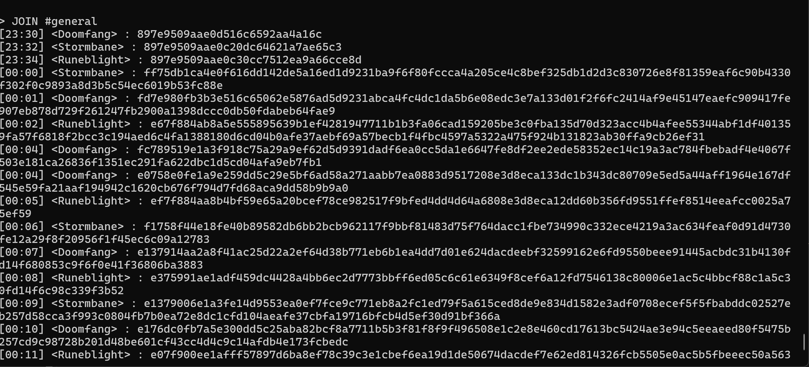
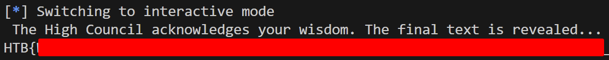
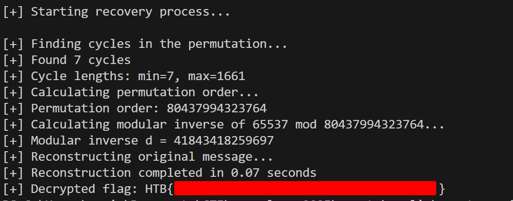
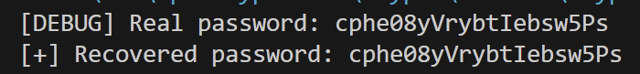

## Traces

For this challenge, we are given a server source code and an instance to connect to:

```python
from db import *
from Crypto.Util import Counter
from Crypto.Cipher import AES
import os
from time import sleep
from datetime import datetime

def err(msg):
    print('\033[91m'+msg+'\033[0m')

def bold(msg):
    print('\033[1m'+msg+'\033[0m')

def ok(msg):
    print('\033[94m'+msg+'\033[0m')

def warn(msg):
    print('\033[93m'+msg+'\033[0m')

def menu():
    print()
    bold('*'*99)
    bold(f"*                                🏰 Welcome to EldoriaNet v0.1! 🏰                                *")
    bold(f"*            A mystical gateway built upon the foundations of the original IRC protocol 📜        *")
    bold(f"*          Every message is sealed with arcane wards and protected by powerful encryption 🔐      *")
    bold('*'*99)
    print()

class MiniIRCServer:
    def __init__(self, host, port):
        self.host = host
        self.port = port
        self.key = os.urandom(32)

    def display_help(self):
        print()
        print('AVAILABLE COMMANDS:\n')
        bold('- HELP')
        print('\tDisplay this help menu.')
        bold('- JOIN #<channel> <key>')
        print('\tConnect to channel #<channel> with the optional key <key>.')
        bold('- LIST')
        print('\tDisplay a list of all the channels in this server.')
        bold('- NAMES #<channel>')
        print('\tDisplay a list of all the members of the channel #<channel>.')
        bold('- QUIT')
        print('\tDisconnect from the current server.')

    def output_message(self, msg):
        enc_body = self.encrypt(msg.encode()).hex()
        print(enc_body, flush=True)
        sleep(0.001)

    def encrypt(self, msg):
        encrypted_message = AES.new(self.key, AES.MODE_CTR, counter=Counter.new(128)).encrypt(msg)
        return encrypted_message

    def decrypt(self, ct):
        return self.encrypt(ct)

    def list_channels(self):
        bold(f'\n{"*"*10} LIST OF AVAILABLE CHANNELS {"*"*10}\n')
        for i, channel in enumerate(CHANNELS.keys()):
            ok(f'{i+1}. #{channel}')
        bold('\n'+'*'*48)

    def list_channel_members(self, args):
        channel = args[1] if len(args) == 2 else None

        if channel not in CHANNEL_NAMES:
            err(f':{self.host} 403 guest {channel} :No such channel')
            return

        is_private = CHANNELS[channel[1:]]['requires_key']
        if is_private:
            err(f':{self.host} 401 guest {channel} :Unauthorized! This is a private channel.')
            return

        bold(f'\n{"*"*10} LIST OF MEMBERS IN {channel} {"*"*10}\n')
        members = CHANNEL_NAMES[channel]
        for i, nickname in enumerate(members):
            print(f'{i+1}. {nickname}')
        bold('\n'+'*'*48)

    def join_channel(self, args):
        channel = args[1] if len(args) > 1 else None

        if channel not in CHANNEL_NAMES:
            err(f':{self.host} 403 guest {channel} :No such channel')
            return

        key = args[2] if len(args) > 2 else None

        channel = channel[1:]
        requires_key = CHANNELS[channel]['requires_key']
        channel_key = CHANNELS[channel]['key']

        if (not key and requires_key) or (channel_key and key != channel_key):
            err(f':{self.host} 475 guest {channel} :Cannot join channel (+k) - bad key')
            return

        for message in MESSAGES[channel]:
            timestamp = message['timestamp']
            sender = message['sender']
            print(f'{timestamp} <{sender}> : ', end='')
            self.output_message(message['body'])

        while True:
            warn('You must set your channel nickname in your first message at any channel. Format: "!nick <nickname>"')
            inp = input('guest > ').split()
            if inp[0] == '!nick' and inp[1]:
                break

        channel_nickname = inp[1]
        while True:
            timestamp = datetime.now().strftime('%H:%M')
            msg = input(f'{timestamp} <{channel_nickname}> : ')
            if msg == '!leave':
                break

    def process_input(self, inp):
        args = inp.split()
        cmd = args[0].upper() if args else None

        if cmd == 'JOIN':
            self.join_channel(args)
        elif cmd == 'LIST':
            self.list_channels()
        elif cmd == 'NAMES':
            self.list_channel_members(args)
        elif cmd == 'HELP':
            self.display_help()
        elif cmd == 'QUIT':
            ok('[!] Thanks for using MiniIRC.')
            return True
        else:
            err('[-] Unknown command.')


server = MiniIRCServer('irc.hackthebox.eu', 31337)

exit_ = False
while not exit_:
    menu()
    inp = input('> ')
    exit_ = server.process_input(inp)
    if exit_:
        break
```


The important part of the code is this piece:

```python
    def output_message(self, msg):
        enc_body = self.encrypt(msg.encode()).hex()
        print(enc_body, flush=True)
        sleep(0.001)

    def encrypt(self, msg):
        encrypted_message = AES.new(self.key, AES.MODE_CTR, counter=Counter.new(128)).encrypt(msg)
        return encrypted_message
```

So whenever someone types in a message it will be encrypted using AES CTR and then printed. Here there is a very obvious key-nonce reuse vulnerability. Cyber Apocalypse 2021 has a challenge with the same [vulnerability](https://www.youtube.com/watch?v=Gtfr1dBGzHg&t=211s). 

In order to exploit the vulnerability, we need to have a plaintext-ciphertext pair. Looking back at the code, we can see that there are two plaintext that we could find out:
`!nick <nickname>` and `!leave`

Let's connect to the instance and join the general channel.

We can see a bunch of ciphertexts




We can see their username and since we know that all users must first run `!nick <username>`, we know that the first 3 ciphertexts would be each of the user setting their username. In order to speed up process, we choose the user with the longest username, `Runeblight` . Here is the code that I used to decrypt the other ciphertexts:

```python
from binascii import unhexlify, hexlify
def xor_bytes(a, b):
  return bytes(x ^ y for x, y in zip(a, b))

ciphertexts = [] # from the channel

known_plaintext = b"!nick Runeblight"

known_ciphertext = unhexlify("6c8c1ddd679ea143859ce6aa7ef4f9b2")

keystream = xor_bytes(known_plaintext, known_ciphertext)

for i in ciphertexts:
  ciphertext = unhexlify(i)
  decrypted = xor_bytes(ciphertext, keystream)
  print("Decrypted text:", decrypted.decode(errors='ignore'))
```

Running the code will give you this output:


```zsh
Decrypted text: !nick Doomfang
Decrypted text: !nick Stormbane
Decrypted text: !nick Runeblight
Decrypted text: We've got a new
Decrypted text: Understood. Has
Decrypted text: Not yet, but I'm
Decrypted text: This channel is
Decrypted text: Here is the pass
Decrypted text: Got it. Only sha
Decrypted text: Yes. Our last mo
Decrypted text: I'm checking our
Decrypted text: Keep me updated.
Decrypted text: I'll compare the
Decrypted text: If everything is
Decrypted text: Hold on. I'm see
Decrypted text: We can't take an
Decrypted text: Agreed. Move all
Decrypted text: Understood. I'm
Decrypted text: !leave
Decrypted text: !leave
Decrypted text: !leave

```


Now we need to do a process called crib dragging, where we deduce what is the next word/letter from the context. Let's take this line for example: `Here is the pass`. We can deduce that it should be `Here is the passphrase ` so we input that as our new known plaintext and replace with the corresponding ciphertext and we get this output:

```zsh
Decrypted text: !nick Doomfang
Decrypted text: !nick Stormbane
Decrypted text: !nick Runeblight
Decrypted text: We've got a new tip abo
Decrypted text: Understood. Has there b
Decrypted text: Not yet, but I'm checki
Decrypted text: This channel is not saf
Decrypted text: Here is the passphrase
Decrypted text: Got it. Only share it w
Decrypted text: Yes. Our last move may
Decrypted text: I'm checking our logs t
Decrypted text: Keep me updated. If the
Decrypted text: I'll compare the latest
Decrypted text: If everything is clear,
Decrypted text: Hold on. I'm seeing str
Decrypted text: We can't take any risks
Decrypted text: Agreed. Move all talks
Decrypted text: Understood. I'm disconn
Decrypted text: !leave
Decrypted text: !leave
Decrypted text: !leave
```

Then repeat the process again until you managed to retrieve the passphrase. Here is the script which will reveal the passphrase:

```python
from binascii import unhexlify, hexlify

def xor_bytes(a, b):
  return bytes(x ^ y for x, y in zip(a, b))

ciphertexts = [] # add the ciphertext here 

known_plaintext = b"Understood. I'm disconnecting now. If they have seen us, we must disappear immediately."

known_ciphertext = unhexlify("188c10db7ecd8759849daae65eb4fce6982d14aaa326b618e341bd9b403d9b9c8029640bb2d2c185f152cbcd623a83cc02cce09f4f479972b894ff3fea3ce652620fcba9150fec4ea9c81382d009ebbacd4a626b02cb5c")

keystream = xor_bytes(known_plaintext, known_ciphertext)

for i in ciphertexts:
  ciphertext = unhexlify(i)
  decrypted = xor_bytes(ciphertext, keystream)
  print("Decrypted text:", decrypted.decode(errors='ignore'))
```

Once we get the passphrase, we can join the secret channel, where you will be met with a similar scenario and have to crib drag again. Yes i know it's tedious but I have no idea if it's possible to automate the process. If anyone is able to make the script for it, please let me know 😊!

Here is the script which will show the flag:

```python
from binascii import unhexlify, hexlify

def xor_bytes(a, b):
    return bytes(x ^ y for x, y in zip(a, b))
ciphertexts = [] # from the channel

# Known plaintext and corresponding ciphertext
known_plaintext = b"I'm already cross-checking our spellwork against the ancient records. If this beacon was part of an older enchantment, I'll find proof. But if it is active now, then we have a problem"
known_ciphertext = unhexlify("ccce105ebb63a2c05351ba57fcc105d4505449d4cce815604e5b29e2fd0147e6680ebda5839ed80ef838771d8cab72669689d736e4a46ef1b87c6c8711905c1bf062f5510b4a2f134352e75ab97fca99f7390be5cf37feadf76ba2e07627a2a7172ae0ddd1bb903236a0cb60c5ba7e9199cf82caf1331c1419ac1bec7a88ebae99fbed12f36a50793da21c06669ffbe861e3851aa693254a392cfe02ac99e38f4ccf7d15fb3d5b4c5a9b5bd0ab391e99109aded5a8cb77")

# Extract keystream
keystream = xor_bytes(known_plaintext, known_ciphertext)

# Ciphertext to decrypt
for i in ciphertexts:
    ciphertext = unhexlify(i)

# Decrypt
    decrypted = xor_bytes(ciphertext, keystream)
    if b"HTB{" in decrypted:
        print(decrypted)
```

## Kewiri

This is a really nice intro to elliptic curve cryptography! I won't be diving into the math behind it in great detail, that's a topic for another post.

We are given an instance to connect to and no source code. So let's connect.

We are met with a series of questions which we need to answer correctly to progress.

```zsh
[!] The ancient texts are being prepared...
You have entered the Grand Archives of Eldoria! The scholars shall test your wisdom. Answer their questions to prove your worth and claim the hidden knowledge.
```

### Question 1
```zsh
You are given the sacred prime: p = 21214334341047589034959795830530169972304000967355896041112297190770972306665257150126981587914335537556050020788061
[1] How many bits is the prime p? >
```

This one is easy, just need to calculate $\lfloor \log_{2} p \rfloor+1$  which turns out to be `384` 

### Question 2
```zsh
[2] Enter the full factorization of the order of the multiplicative group in the finite field F_p in ascending order of factors (format: p0,e0_p1,e1_ ..., where pi are the distinct factors and ei the multiplicities of each factor) >
```

The order of the multiplicative group in the finite field $\mathbb{F}_p$ is `p-1`. We can then use [factordb.com](https://factordb.com/) to factorize it. When you do, the answer will be `2,2_5,1_635599,1_2533393,1_4122411947,1_175521834973,1_206740999513,1_1994957217983,1_215264178543783483824207,1_10254137552818335844980930258636403,1` 


### Question 3
```zsh
[3] For this question, you will have to send 1 if the element is a generator of the finite field F_p, otherwise 0.

8206043701065389724963669420675066852059393972220445842869021785657999923448925942453110096327055938147312724419425? >
```

Question 3 has multiple element but we can check them all in the same way. An element is a generator of the finite field $\mathbb{F}_p$ if it is a primitive root modulo p or not. This [stack exchange post ](https://math.stackexchange.com/questions/124408/finding-a-primitive-root-of-a-prime-number) does a great job of explaining it but to summarize, we just need to calculate the prime factors of p-1, let's say its f, then check whether or not $g^{(p-1)/f}$ mod p is equal to 1. If there is even a single value of f which the result is 1, then g is not a generator. We have the prime factors of p-1 from question 1 so it's easy to solve this question. Here is my python script:

```python
def is_generator(g, p, factorization):
  for prime in factorization.keys():
    exp = (p - 1) // prime
    if pow(g, exp, p) == 1:
      return 0  # Not a generator
  return 1  # Is a generator
```

There are 17 elements to test so just do a for loop.

### Question 4
```zsh
The scholars present a sacred mathematical construct, a curve used to protect the most guarded secrets of the realm. Only those who understand its nature may proceed.
a = 408179155510362278173926919850986501979230710105776636663982077437889191180248733396157541580929479690947601351140
b = 8133402404274856939573884604662224089841681915139687661374894548183248327840533912259514444213329514848143976390134
[4] What is the order of the curve defined over F_p? >
```

Starting from this question going forward, we will be using a great mathematics software system called [sagemath](https://www.sagemath.org/) to help us out. All scripts moving forward will use the file extension `.sage` .

We can use sage to help us calculate the order of the elliptic curve defined over $\mathbb{F}_p$ .

```python
# Define the prime p
p = 21214334341047589034959795830530169972304000967355896041112297190770972306665257150126981587914335537556050020788061

# Define the elliptic curve E: y^2 = x^3 + ax + b over F_p
a = 408179155510362278173926919850986501979230710105776636663982077437889191180248733396157541580929479690947601351140
b = 8133402404274856939573884604662224089841681915139687661374894548183248327840533912259514444213329514848143976390134
E = EllipticCurve(GF(p), [a, b])

# Compute the exact order of the elliptic curve
print(E.order())

```

The order will be: `21214334341047589034959795830530169972304000967355896041112297190770972306665257150126981587914335537556050020788061` . Notice that the order of the curve is equal to p, this will be important moving forward.

### Question 5
```zsh
[5] Enter the full factorization of the order of the elliptic curve defined over the finite field F_{p^3}. Follow the same format as in question 2 >
```

For this question, we'll utilize [Hasse's theorem](https://dspace.mit.edu/bitstream/handle/1721.1/122962/18-783-spring-2017/contents/lecture-notes/MIT18_783S17_lec8.pdf) and the generalization [I found in stack exchange](https://math.stackexchange.com/questions/144194/how-to-find-the-order-of-elliptic-curve-over-finite-field-extension). Hasse's theorem states that the order of a curve defined over $\mathbb{F}_p$ is equal to `p + 1 - t` where `t` is the `trace of the Frobenius`. We know that the order is equal to p, meaning that `t` = 1. The generalization states that $\mathbb{F}_p{n}$ is equal to  $p^n +1 - S_{n}$ , where $S_{0} = 2, S_{1} = t$ , and $S_{n+1} = tS_{n}-pS_{n-1}$. Substituting `t` = 1, we get that the order of the curve over $\mathbb{F}_p{3}=p^3+1-(1-2p)-p$ or $p^3-p$ . Plugging in p and then trying to factor the result with factordb will fail but we can simplify things: $p(p^2-1)$ , meaning that we would only need to find the factor of $p^2-1$ and factordb could find that. The answer to the question will be `2,2_7,2_21214334341047589034959795830530169972304000967355896041112297190770972306665257150126981587914335537556050020788061,1_2296163171090566549378609985715193912396821929882292947886890025295122370435191839352044293887595879123562797851002485690372901374381417938210071827839043175382685244226599901222328480132064138736290361668527861560801378793266019,1` 

### Question 6(Final one)
```zsh
The final trial awaits. You must uncover the hidden multiplier "d" such that A = d * G.
⚔️ The chosen base point G has x-coordinate:
10754634945965100597587232538382698551598951191077578676469959354625325250805353921972302088503050119092675418338771
🔮 The resulting point A has x-coordinate:
4692319187596312436642460973072817697242839814797813968357917307635634211087693765366308484532559104357901955826938
```

Note that A is randomized everytime you run it but G is not.

This is as problem called Elliptic Curve Discrete Logarithm Problem(ECDLP) and many elliptic curve cryptosystem rely on the fact that this problem is hard to solve. However in this case, there is 1 major flaw, the order of the curve is equal to it's modulus, also known as a Anomalous Curve. An anomalous curve is vulnerable to [Smart's Attack](https://github.com/elikaski/ECC_Attacks). You can find the implementation of the attack online, but sage has a built-in function called `.log` which could help us solve various DLP/ECDLP problems. Here is the script:

```python
a = 408179155510362278173926919850986501979230710105776636663982077437889191180248733396157541580929479690947601351140
b = 8133402404274856939573884604662224089841681915139687661374894548183248327840533912259514444213329514848143976390134

# Define the elliptic curve
E = EllipticCurve(GF(p), [a, b])

# Define the generator point G (we only have x-coordinate, need to find y)

G = E.lift_x(Gx)

# Define point A
A = E.lift_x(A_x)

# Compute the discrete logarithm (d)
d = A.log(G)
print(d)
```

Note that if you're using `pwntools` to do the scripting you'll have to change the type of A_x from `int` using `A_x = GF(p)(A_x)` , the same thing applies to Gx if you decide to script it. Once you get `d` and send it you'll solve the challenge and get the flag 🥳🎆



I'll leave the pwntools scripting to you 😉

## Prelim

For this challenge, we are given a source code and a `tales.txt` output file. Here is the source code :
```python
from random import shuffle
from hashlib import sha256
from Crypto.Cipher import AES
from Crypto.Util.Padding import pad

n = 0x1337
e = 0x10001

def scramble(a, b):
    return [b[a[i]] for i in range(n)]

def super_scramble(a, e):
    b = list(range(n))
    while e:
        if e & 1:
            b = scramble(b, a)
        a = scramble(a, a)
        e >>= 1
    return b

message = list(range(n))

shuffle(message)

scrambled_message = super_scramble(message, e)

flag = pad(open('flag.txt', 'rb').read(), 16)

key = sha256(str(message).encode()).digest()
print(scrambled_message)
print(key)
enc_flag = AES.new(key, AES.MODE_ECB).encrypt(flag).hex()

with open('tales.txt', 'w') as f:
     f.write(f'{scrambled_message = }\n')
     f.write(f'{enc_flag = }')
```


Here there are 2 important functions `scramble` and `super_scramble` . If we are able to reverse this, we'll be able to get the key and decode the flag. Let's see what each function does.

`scramble` is simple, it just creates a list by indexing `b` using the values in `a`, so for example, if `a = [2, 0, 1]` and `b = [10, 20, 30]` it will return `[30, 10, 20]` 

`super_scramble` is more complex and is the meat of the challenge. Essentially, this applies the RSA encryption algorithm in symmetric groups. There is also a similar vulnerability where `n` is actually a prime and not a product of two primes. To solve this challenge, I used this solver generated by chatgpt:

```python
from random import shuffle
from hashlib import sha256
from Crypto.Cipher import AES
from Crypto.Util.Padding import pad, unpad
from math import gcd
import time

def lcm(a, b):
    return a * b // gcd(a, b)

def multi_lcm(numbers):
    result = 1
    for num in numbers:
        result = lcm(result, num)
    return result

def reverse_super_scramble(scrambled_message, n=0x1337, e=0x10001):
    print("[+] Finding cycles in the permutation...")
    start_time = time.time()

    # Find all cycles in the permutation
    cycles = []
    visited = [False] * n

    for i in range(n):
        if not visited[i]:
            cycle = []
            j = i
            while not visited[j]:
                visited[j] = True
                cycle.append(j)
                j = scrambled_message[j]
            cycles.append(cycle)

    print(f"[+] Found {len(cycles)} cycles")
    print(f"[+] Cycle lengths: min={min(len(c) for c in cycles)}, max={max(len(c) for c in cycles)}")

    # Calculate the order of the permutation (LCM of cycle lengths)
    print("[+] Calculating permutation order...")
    order = 1
    for cycle in cycles:
        order = lcm(order, len(cycle))

    print(f"[+] Permutation order: {order}")

    # Calculate the modular inverse of e with respect to the order
    print(f"[+] Calculating modular inverse of {e} mod {order}...")
    d = pow(e, -1, order)
    print(f"[+] Modular inverse d = {d}")

    # Now we can compute the original permutation
    print("[+] Reconstructing original message...")
    original_message = [0] * n

    # For each position in the final result
    for original_pos in range(n):
        # Find which cycle this value belongs to and its position in that cycle
        for cycle in cycles:
            try:
                # Find where the value appears in the cycle
                idx = cycle.index(original_pos)
                # Calculate where it came from by going back d steps
                src_idx = (idx - d) % len(cycle)
                # The value at this position in the original message
                original_message[cycle[src_idx]] = original_pos
                break
            except ValueError:
                continue

    end_time = time.time()
    print(f"[+] Reconstruction completed in {end_time - start_time:.2f} seconds")


    return original_message

def main():
    # Prime n value as mentioned
    n = 0x1337  # 4919
    e = 0x10001  # 65537
    scrambled_message = []
    enc_flag = 'ca9d6ab65e39b17004d1d4cc49c8d6e82f9fa7419824d07096d41ee41f0578fe6835da78bc31dd46587a86377883e0b7'
    enc_flag_bytes = bytes.fromhex(enc_flag)
    print("\n[+] Starting recovery process...\n")

    recovered_message = reverse_super_scramble(scrambled_message, n, e)

    recovered_key = sha256(str(recovered_message).encode()).digest()

    try:
        decrypted_flag = AES.new(recovered_key, AES.MODE_ECB).decrypt(enc_flag_bytes)
        decrypted_flag = unpad(decrypted_flag, 16)
        print(f"[+] Decrypted flag: {decrypted_flag.decode()}")
    except Exception as e:
        print(f"[-] Decryption failed: {e}")

if __name__ == "__main__":
    main()(base)
```


In order to explain this, we'll use a small example.

let's say we have an array `["A","B","C", "D"]` and we scramble it with this permutation `[2,0,3,1]` , So after the scramble, it will become `["B","D","A","C"]`

We need to find the cycle in the permutation

0 -> 2 -> 3 -> 1 -> 0 is a cycle, so the cycle has length 4. Meaning that if we apply the permutation 4 times, it will revert back to it's original message.

let's say for this example `e` = 3, meaning that the permutation is applied 3 times. So to undo the scrambling we need to find out how many steps backwards we need to move. We can do this by computing the modular inverse of e modulo the length of the cycle(4)

The modular inverse of 3 mod 4 is 3, so we move back 3 times.

Here is the output:




## Hourcle

We are given a server source code and an instance to connect to:

```python
from Crypto.Cipher import AES
from Crypto.Util.Padding import pad
import os, string, random, re

KEY = os.urandom(32)

password = ''.join([random.choice(string.ascii_letters+string.digits) for _ in range(20)])

def encrypt_creds(user):
    padded = pad((user + password).encode(), 16)
    IV = os.urandom(16)
    cipher = AES.new(KEY, AES.MODE_CBC, iv=IV)
    ciphertext = cipher.decrypt(padded)
    return ciphertext

def admin_login(pwd):
    return pwd == password


def show_menu():
    return input('''
=========================================
||                                     ||
||   🏰 Eldoria's Shadow Keep 🏰       ||
||                                     ||
||  [1] Seal Your Name in the Archives ||
||  [2] Enter the Forbidden Sanctum    ||
||  [3] Depart from the Realm          ||
||                                     ||
=========================================

Choose your path, traveler :: ''')

def main():
    while True:
        ch = show_menu()
        print()
        if ch == '1':
            username = input('[+] Speak thy name, so it may be sealed in the archives :: ')
            pattern = re.compile(r"^\w{16,}$")
            if not pattern.match(username):
                print('[-] The ancient scribes only accept proper names-no forbidden symbols allowed.')
                continue
            encrypted_creds = encrypt_creds(username)
            print(f'[+] Thy credentials have been sealed in the encrypted scrolls: {encrypted_creds.hex()}')
        elif ch == '2':
            pwd = input('[+] Whisper the sacred incantation to enter the Forbidden Sanctum :: ')
            if admin_login(pwd):
                print(f"[+] The gates open before you, Keeper of Secrets! {open('flag.txt').read()}")
                exit()
            else:
                print('[-] You salt not pass!')
        elif ch == '3':
            print('[+] Thou turnest away from the shadows and fade into the mist...')
            exit()
        else:
            print('[-] The oracle does not understand thy words.')

if __name__ == '__main__':
    main()
```


Here, there are 2 important things to notice, first is that the key is reused and second is that we are "encrypting" our plaintext by decrypting it. To solve this challenge, we need to understand how AES CBC encryption and decryption works.


We can see that during decryption, the first block ciphertext is passed through the decryption algorithm and then the result is xored with the IV, the second block is the same but it get xored with the first block instead of the IV, third block get xored with the second block and so on. Here we can see the vulnerability, as long as the previous block ciphertext doesn't change, the current block plaintext will be deterministic, meaning we could input our user as 31 A's and the first block will be filled with 16 A's and the second block has 15 A's and the first character of the password, we can then bruthforce that one character by test all possible character `c`, then setting the user to be 31 A's + `c` and see which value `c` results in the same second block result. To better understand it, here is a visualization:

```
let ( data ) be the result of the decryption on data

lets say the user = A*31 and the secret to be s and a character we guesed to be g 

(A*16) | (A*15 + s[0]) | .... 

we can then try every possible combination of g and append it to the user so that the user would be A*31 + g 

(A*16) | (A*15 + g) 

if g = s[0], since the second block is deterministic, the ciphertext would be the same so we've recovered the first character of the password then set the user to be A*30 

(A*16) | (A*14 + s[0] + s[1]) 

now we just need to set the payload to bruth force to be A*30 + s[0] + g 

we then get s[1] next we set the user to be A*29 (A*16) | (A*13) + s[0] + s[1] + s[2] 

set the payload to bruthforce to be A*29 + s[0] + s[1] + g we then get s[2] and repeat
```

Note that in the actual challenge, we need to extend the A's till the third block because there is a regex which checks whether or not the length of the user is less than 16, and if you extend the A's to the second block, at the 17th character of the password the user will have length of 15 and the regex will catch it. However, the concept still works the same

Here is a proof of concept I made to show that it indeed works

```python
from Crypto.Cipher import AES
from Crypto.Util.Padding import pad
import os, string, random

KEY = os.urandom(32)

password = ''.join([random.choice(string.ascii_letters + string.digits) for _ in range(20)])
print(f"[DEBUG] Real password: {password}")


def encrypt_creds(user):
    padded = pad((user + password).encode(), 16)
    IV = os.urandom(16)
    cipher = AES.new(KEY, AES.MODE_CBC, iv=IV)
    ciphertext = cipher.decrypt(padded)  
    return ciphertext


charset = string.ascii_letters + string.digits
known_password = ""

for i in range(20): 
    padding_length = 31 - i 
    payload = "A" * padding_length  
    reference_ciphertext = encrypt_creds(payload)
    password_block = reference_ciphertext[16:32]  
    for char in charset:
        test_payload = "A" * padding_length + known_password + char  
        test_ciphertext = encrypt_creds(test_payload)
        test_block = test_ciphertext[16:32]  
        if test_block == password_block:  
            known_password += char
            break  
print(f"[+] Recovered password: {known_password}")

```



As usual, I'll leave the pwntools scripting to you, and don't forget to extend the A's to the third block instead of the second. 


## Final Thoughts

I had a great time in this CTF and learned a lot of new things. I'm especially proud of myself for figuring out the idea behind `Hourcle` without help from any LLMs. This is my first HTB CTF event that I joined, and I look forward to many more in the future. Kudo's to all the problem makers for making such great quality challenges ~~except for Joey who I will forever hate for making hillside, just joking lol~~ . If you have any feedback on my blog or writeups, or just want to talk to me, feel free to contact me on discord.

Have fun and keep hacking!


