import Challenge from '@/components/Challenge.astro'
import Callout from '@/components/Callout.astro'

<div class="invisible h-0! [&+*]:mt-0 [&+*_*]:mt-0">
</div>

<Challenge
  title="Intern"
  authors={['Karev']}
  category="Forensics"
  flag="COMPFEST18{hopefully_there_isnt_too_much_questions_<ran_16>}"
>
  A company's employee recently fell victim to a ransomware attack. The company has hired you and your firm to find out what happened. After hearing the details of the attack, you realized that it sounded familiar to another attack that happened a few months back. The police managed to arrest one of the criminal responsible for it but they failed to arrest his partners. Luckily you know someone in the police department so you asked your intern to gather evidence from the victim's computer while you meet your friend to see if he could give you any evidence they got from the captured criminal's computer. After collecting the evidence, you realized that your intern has done a teribble job at acquisition and missed out a lot of potentially important forensics artifacts. Could you still find out what happened?. 

Download the artifacts from : https://drive.google.com/file/d/1uZKu7_eFSJxJb9RJfj94bchoDHzyPkck/view?usp=sharing

Password: sEzXzWyqRt95ASRH

Notes:
1. All malwares found in this challenge are working malware. DO NOT RUN IT ON YOUR HOST COMPUTER, USE A SANDBOX/VM. I am not responsible for any damages on your computer.
2. \{12b27ea2-0101-4435-a4af-5a8743ce345f} is the evidence from the criminal's computer while \{f1733278-c744-4bf0-9b9a-b1dfb278f4bf} is from the victim's computer
3. Unless specified otherwise, for questions needing multiple answers, the order of the answer you provide does not matter.
</Challenge>


`Intern` is a hard-insane difficulty forensics challenge I created for COMPFEST CTF 18 and this is my writeup. I won't be giving out all the scripts for this challenge because I want you guys to have some effort to do. Without further ado, let's start.

# Writeup

## Question 1

```
Before starting your investigation, supply the BLAKE3 hash of the forensics artifacts to verify its integrity

Notes:
- You may use https://github.com/BLAKE3-team/BLAKE3/releases/tag/1.8.5 to calculate the BLAKE3 hash
```

Alright pretty simple just get the hash

```powershell
.\b3sum_windows_x64_bin.exe *
6d97129e85a6552bb07a8a83037eae7cda2022ffd4370b7dbc8a2ed59c05f696  {12b27ea2-0101-4435-a4af-5a8743ce345f}.ad1
deff31d22f07b9f546b146d1417e758bf77e260d39b18ec8eb5d29d9dc58cb9b  {12b27ea2-0101-4435-a4af-5a8743ce345f}.elf
233138454a22accfea9eaaf76bda028d8787acbf16aed83fd6291eff05d3b748  {f1733278-c744-4bf0-9b9a-b1dfb278f4bf}.ad1
```

## Question 2

```
Which program serves as the initial entry point for malware?
```

We can direct our attention to the `ad1` file we're given. There are lots of ways to go about finding this answer but I'll choose the way which makes it easier to solve the next 2 questions, checking the user's browser history. The victim is using Microsoft Edge as their browser so let's dump the db and check their history.

```zsh
sqlite3 History                                                                                         SQLite version 3.50.4 2025-07-30 19:33:53
Enter ".help" for usage hints.
sqlite> .tables
cluster_keywords                  edge_urls
cluster_visit_duplicates          edge_visits
clusters                          history_sync_metadata
clusters_and_visits               keyword_search_terms
content_annotations               meta
context_annotations               segment_usage
downloads                         segments
downloads_slices                  urls
downloads_url_chains              visit_source
edge_downloads                    visited_links
edge_favicons                     visits
edge_keyword_search_terms_source
sqlite> select * from downloads;
1|a63a09cd-e8c2-4baf-b4f6-ec53aab0da89|C:\Users\employee-1\Downloads\putty-64bit-0.83-installer.msi|C:\Users\employee-1\Downloads\putty-64bit-0.83-installer.msi|13421187116380102|3831808|3831808|1|4|0||13421187131271225|1|13421187135986935|0|https://www.chiark.greenend.org.uk/||
^H
|https://www.chiark.greenend.org.uk/~sgtatham/putty/latest.html|https://putty.org/|||||"3a7800-62d13041acde0"|Sat, 01 Feb 2025 11:32:36 GMT|application/x-msi|application/x-msi
2|6ea03fe4-a742-4f51-9c9e-768db74396e1|C:\Users\employee-1\Downloads\vscode-helloworld-0.3.0.vsix|C:\Users\employee-1\Downloads\vscode-helloworld-0.3.0.vsix|13427031744672949|5722|5722|1|4|0||13427031745773851|0|0|0|https://github.com/whiskerstein-cf/helloworld-vscode/releases/tag/0.3.0||
^H
|https://github.com/whiskerstein-cf/helloworld-vscode/releases/tag/0.3.0||||||"0x8DED43ADCA6C190"|Sat, 27 Jun 2026 10:57:20 GMT|application/octet-stream|application/octet-stream
3|96e3717c-1f77-45af-9137-da61226be2ff|C:\Users\employee-1\Downloads\VSCodeUserSetup-x64-1.126.0.exe|C:\Users\employee-1\Downloads\VSCodeUserSetup-x64-1.126.0.exe|13427031778489091|201266976|201266976|1|4|0||13427031833331559|1|13427031994550322|0|https://code.visualstudio.com/||
^H
|https://code.visualstudio.com/thank-you?dv=win64user|https://code.visualstudio.com/Download?_exp_download=fb315fc982|||||"0x038E79F1A261572291E6C57D45D2EEABE9921B595678E2AA5ECC08EEA6018BEC"|Tue, 23 Jun 2026 10:25:40 GMT|application/x-msdownload|application/octet-stream
```

Only suspiscous thing the user downloaded is an extension from the repo `helloworld-vscode`. Vscode extension could be found in the `.vscode` foler, and there we can get the name of the extension which is `vscode-helloworld`

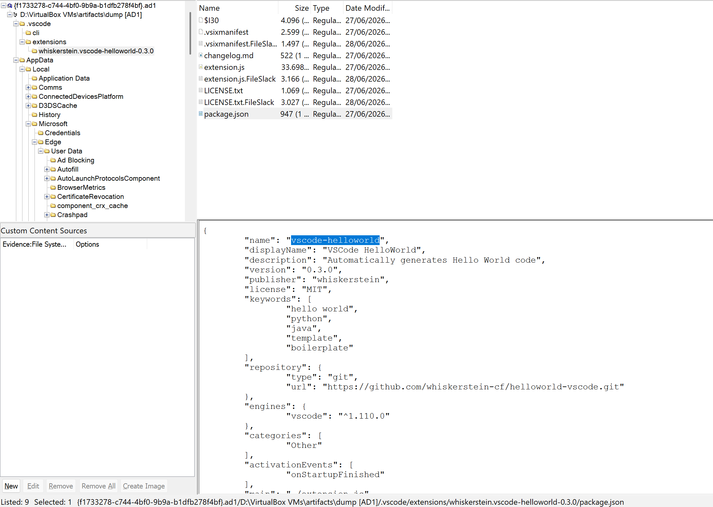

## Question 3

```
What is the url from which the victim downloaded that program
```

The answer is also in the db : `https://github.com/whiskerstein-cf/helloworld-vscode/releases/tag/0.3.0`

## Question 4

```
What is the timestamp when the victim downloaded that program in UTC format

Format: YYYY-MM-DD HH:mm:SS
```

We can use the db again to get the answer and also convert it to UTC

```sql
sqlite> SELECT datetime(start_time / 1000000 - 11644473600, 'unixepoch') AS download_time_utc
FROM downloads
WHERE tab_url = 'https://github.com/whiskerstein-cf/helloworld-vscode/releases/tag/0.3.0';
2026-06-27 11:02:24
sqlite>
```

## Question 5

```
As of June 2026, how many versions of the program is available?
```

Now you can guess this that the answer is `3` from the fact that the victim downloaded version `0.3.0` and we can assume that it is the newest at the time. However the intended path is to use the [wayback machine](https://web.archive.org/web/20260627105918/https://github.com/whiskerstein-cf/helloworld-vscode) to take a look at the repo. 

## Question 6

```
It seems the github repo has been taken down, however we managed to clone it before it us taken down. You could download it from https://drive.google.com/file/d/14lDbL1nf1ovRQxRlb-QgZ-2k-o3DOAUy/view?usp=sharing using the password 'compfest18'. On which version was the malicious code first introduced

Notes: Moving forward all program/binary that we retrieve will use the password 'compfest18'
```

We can extract the archive and check the releases page. There you can see 2 versions, `0.2.0` and `0.3.0`, again of course you can guess the answer to this question as there are only 2 versions but the intended path is to extract the `.vsix` file then check the extension source code. Opening the source code of `0.2.0` on vscode, you'll see this weird thing

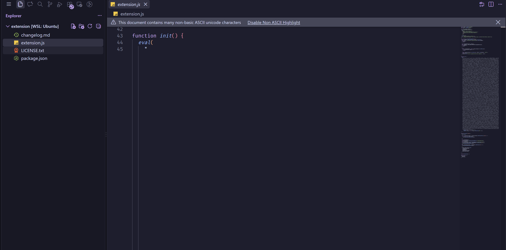

which is obviously not normal and malicious.

## Question 7

```
What is the url which the malicious code made a request to
```

The invisible unicode character was created using [this repo](https://github.com/oscar-mine/InvisibleJS). To decode it the simplest way is to copy the program then replace the eval with console.log where then you'll get a js script and see that the url is `http://192.168.0.114:6767/AnyDesk.exe`

## Question 8

```
We've retreived a binary from that url, you can download it from https://drive.google.com/file/d/1ivm2SJhM1SYbi2TXB4RVqg7SA2yyks2V/view?usp=sharing. What is the sha256 hash of the binary.
```
Simple enough, just get the hash. I'm getting lazy to put out all the command output so for this kind of questions I'll let you guys do it.

## Question 9

```
Analyze the binary and recover the files in the victim's Documents folder. What is the content of notes.txt
```

The binary is a golang ransomware. When I compile it, there was no obfuscation or any anti-analysis so any trouble you get reversing the binary is just golang being golang. I won't go through the process of reversing the logic cause this writeup is already long enough without it, instead I'll just tell you that the ransomware uses the algorithm from [this blog](https://andrea.corbellini.name/2023/01/02/ec-encryption/). Since the encryption is using asymetric cryptography so obviously in order to decrypt it there must be a flaw in the implementation/parameters, and indeed thats the case here.

Checking the binary in IDA, we can find the function `main.buildCurve`

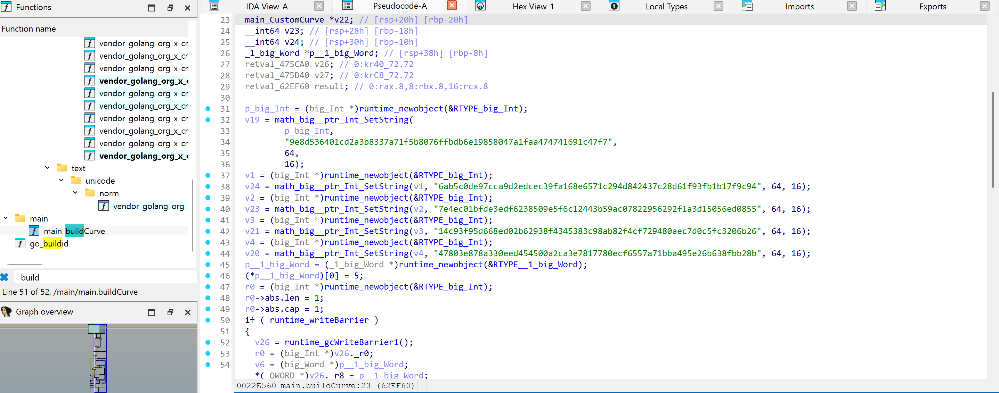

Here the vulnerabiliy lies on the fact that on those parameters, the curve is what we call an anomalous curve where the order of the curve equals to p. 

```bash
sage: p = 0x9e8d536401cd2a3b8337a71f5b8076ffbdb6e19858047a1faa474741691c47f7
sage: a = 0x6ab5c0de97cca9d2edcec39fa168e6571c294d842437c28d61f93fb1b17f9c94
sage: b = 0x7e4ec01bfde3edf6238509e5f6c12443b59ac07822956292f1a3d15056ed0855
sage: g_x = 0x14c93f95d668ed02b62938f4345383c98ab82f4cf729480aec7d0c5fc3206b26
sage: g_y = 0x47803e878a330eed454500a2ca3e7817780ecf6557a71bba495e26b638fbb28b
sage: E = EllipticCurve(GF(p), [a, b])
sage: G = E(g_x, g_y)
sage: assert E.order() == p
```

This kind of curve is vulnerable to [smart's attack](https://github.com/elikaski/ECC_Attacks#The-curve-is-anomalous) which we can use to get the private key and decrypt the file.

## Question 10

```
What application did the hacker use to communicate with his partner
```

Now we'll head over to the `ad1` dump of the hacker. It isn't hard to notice that he uses discord, but if you try submitting that as the answer, you'll get it wrong. However there isnt anymore social media in the dump. Let's try to dump the discord `Cache_Data` and use `ChromeCacheView` to look for any messages.

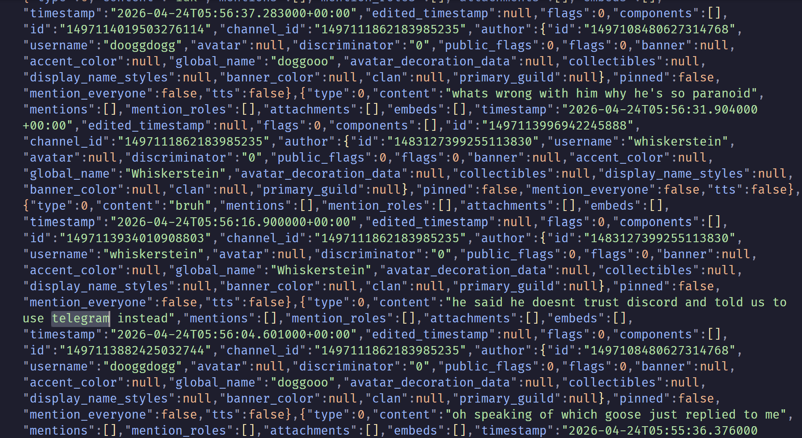

Here we see that they mention that one of their member doesnt trust discord and want to use telegram instead. Meaning the answer is telegram and discord

## Question 11

```
How many parters does the hacker have?
```

Also from the discord cache you can see that the hacker have 2 partners

## Question 12

```
What is the hacker and his partner's username on Discord
```

Still on the discord cache, you can see that their usernames are `dooggdogg` and `whiskerstein`.

## Question 13

```
What is the name of the other partner
```

Based on the discord messages, you can see that the partner name is `goose`

## Question 14

```
How many malicious binary did the hacker and his partner made
```

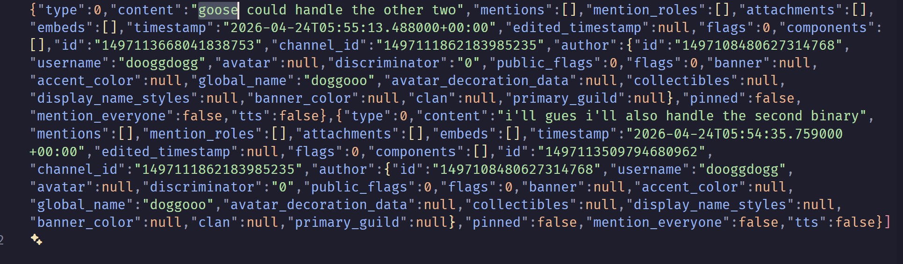

Looking at the messages we can see that `goose` will handle the other 2 binary while `dooggdogg` handles the second binary implying that there are 4.

## Question 15

```
After some investigation on the ransomware you found out that it is also exfiltrating the files, what is the full url where it is exfiltrated to
```
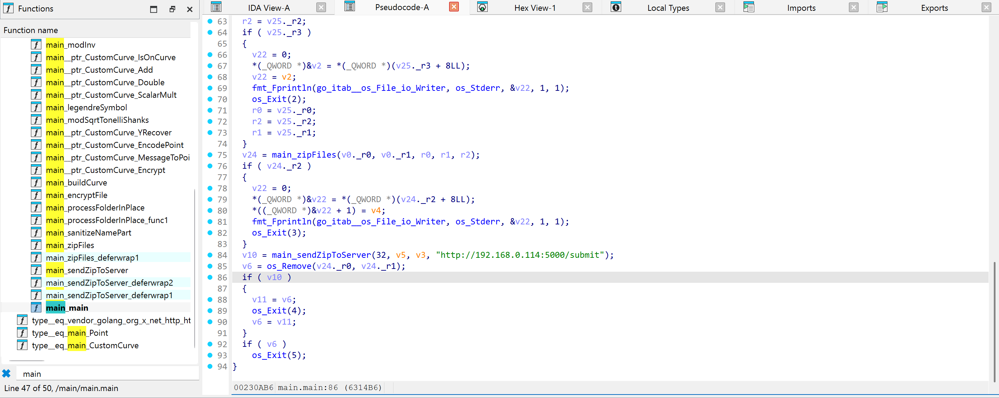

Pretty easy

## Question 16

```
What are the credentials which could be used on the web login page
```
Okay now we're on whats probably the hardest question.

The credentials are stored in Microsoft Edge's password manager, which is encrypted using ABE. According to [this](https://github.com/runassu/chrome_v20_decryption) github repo, in order to decrypt it we need the get the SYSTEM DPAPI and also the user DPAPI. We can use [this](https://tools.thehacker.recipes/mimikatz/modules/lsadump/secrets) reference to get the SYSTEM DPAPI using mimikatz.

```
mimikatz # lsadump::secrets /system:"D:\VirtualBox VMs\artifacts\real\testing\SYSTEM" /security:"D:\VirtualBox VMs\artifacts\real\testing\SECURITY"
Domain : DESKTOP-02672LH
SysKey : 439675e056531844a61c20a7814be6a3

Local name : DESKTOP-02672LH ( S-1-5-21-1173333265-278651773-1300844780 )
Domain name : WORKGROUP

Policy subsystem is : 1.18
LSA Key(s) : 1, default {5eca6b13-e3e6-df22-e105-7ecb51ce483e}
  [00] {5eca6b13-e3e6-df22-e105-7ecb51ce483e} 862c068952f75e199984e5d170d46e818f77a0d3c5c897782ac0e521d8fc2f4a

Secret  : DefaultPassword
old/text: compfest

Secret  : DPAPI_SYSTEM
cur/hex : 01 00 00 00 8e 41 91 e6 3c d5 33 e1 f5 c8 bf f7 8d 7b 15 6b bf ef f2 2e 72 7b 19 88 cb 1a 0d b4 cf ed 63 c9 a0 0e 38 fb 8e 04 9e a4
    full: 8e4191e63cd533e1f5c8bff78d7b156bbfeff22e727b1988cb1a0db4cfed63c9a00e38fb8e049ea4
    m/u : 8e4191e63cd533e1f5c8bff78d7b156bbfeff22e / 727b1988cb1a0db4cfed63c9a00e38fb8e049ea4
old/hex : 01 00 00 00 9d 62 0c 3c e7 a7 68 e0 68 b4 e3 6a e7 14 1f 99 eb 96 c8 4c 4a 65 48 13 12 3f bd e3 ff 3d 30 b8 45 88 f6 96 f7 28 c0 f4
    full: 9d620c3ce7a768e068b4e36ae7141f99eb96c84c4a654813123fbde3ff3d30b84588f696f728c0f4
    m/u : 9d620c3ce7a768e068b4e36ae7141f99eb96c84c / 4a654813123fbde3ff3d30b84588f696f728c0f4

Secret  : NL$KM
cur/hex : 7c 7a 72 cb 23 08 f8 77 dd ab e2 4e d2 d8 b9 0b df 79 95 de 9f 9c dd b8 0c 60 7e 78 a0 c7 36 d7 56 b2 74 0b aa 3a eb 2c a0 91 82 a7 07 02 ec a7 87 d4 6e 6f a0 73 20 84 a4 76 b7 55 b1 2b de f1
old/hex : 7c 7a 72 cb 23 08 f8 77 dd ab e2 4e d2 d8 b9 0b df 79 95 de 9f 9c dd b8 0c 60 7e 78 a0 c7 36 d7 56 b2 74 0b aa 3a eb 2c a0 91 82 a7 07 02 ec a7 87 d4 6e 6f a0 73 20 84 a4 76 b7 55 b1 2b de f1
```

Okay now how do we get the User DPAPI key? One might try to crack using john but that doesnt work because the password is secure ~~which i forgot to include that information in the description, oops~~. We can get it by following the method from [this writeup](https://www.hackthebox.com/blog/memory-dump-analysis-with-signal#mcetoc_1ifirlesjfrv). However, if you followed it to the tee, you'll find that it didn't work because the key we got from the plugin is wrong. This is likely because of a bug in the plugin. But fear not as we can still find a workaround. Again from the hacker tools [notes](https://tools.thehacker.recipes/mimikatz/modules/dpapi/masterkey) we see that we can decrypt the masterkey if we know the user's SHA1 hash, which we do!

```bash
vol -p /mnt/c/Users/gamin/Documents/CTF/tools/volatility3/volatility3/plugins -f "{12b27ea2-0101-4435-a4af-5a8743ce345f}.elf" pypykatz
Volatility 3 Framework 2.26.0
Progress:  100.00               PDB scanning finished
credtype        domainname      username        NThash  LMHash  SHAHash masterkey       masterkey(sha1) key_guid        password

msv     DESKTOP-02672LH Whiskerstein    d58b6e8440e1e6400a97a7b1022163b9                5747ad7437fb64f3588be29e3af043b37273ef99
dpapi                                           dddb7cef1070aaa732825f000b786a57ef20d514d122db4820f1009ebd32538700cfa8ded1e5e0cb77e4b96b4f33ffdf3b32ad8e6ec0fa01fe6ff7486c5bac88    6e3eb083c6ee39f50ca0d1b18b5c05b8e9d3e963        20b169d0-52e5-4f45-bd16-9f8c6be78f1f
dpapi                                           2d06d846ff5142f9873a5f847f8157eb3df697a917db76d606610dc681880fc4d5fccd9b3822293b5042b3742071e444792863c414d6f38bf2a00fa44f15a618    c4ea92d8d2a7f0c86f57a1c1060ea21bb9918a44        60d8b932-86b2-48e2-8cd9-3987ca309dda
dpapi                                           80ee4f06a4907f9bfb5a84602663bf366f0b43b8b3d74c85b89efaf16ed566fc9d3b9411052ae9f773934d4f53fe08a15f286643a3448a545d338c6d027b08d7    145a40064514ffe473a28a5239635acde9e6fc0a        d5ebd623-ea07-49bc-8e89-fb56ff143327
msv     DESKTOP-02672LH Whiskerstein    d58b6e8440e1e6400a97a7b1022163b9                5747ad7437fb64f3588be29e3af043b37273ef99
dpapi                                           2000302ce5ac2df2c5cdbdbdd76e1c8bad740f9284bc5bffa09c2f82a8586da6ddf3b71cb340a83ebee2a0b539c64ad75742931bbe32264a5beff4b0428ca05f    1cb9f92c7d20f2543fd2ae2f0835e5afaec63e23        2da70213-af60-46f1-95ce-14e6b4372ff9
dpapi                                           6fa8ab5b590e320b5adfeff763be50a8b2cfc2ba9178c87d49fe69e02466e8e5180262b8a2fa63abf8a1bb7c71fe4fc67b6a31f91ca20242c503dcf7bf3df0ea    72836c2d8f7c73d413dfa6d844cb85cec9a7b305        76e7ba38-72cb-4119-aa12-f9c8483b22da
dpapi                                           475d9e836a9956d4ba5c5e771d209c3bacfd868d836600fd766b1352b501ad6c4dfb266e4b57dc4f6fa9faf6318a67379c810a4980ccf100f4f0acc40a60c9ed    a697a3255f85b5b8cba317bb1a77b4e4dfc125ca        60f9c585-d699-4c76-b7e7-d18e72b1627f
dpapi                                           db02e19e46c00438eaba6444eb827158a09d51dab4cb2eb4a6ed1d639d64ca4a72d9d1e270d7d1516cf361a1c7e4419fd81e738b399f507b858ff8efb0a9ccee    dc7707112a1f1d2d23cf47b90154aaa0c44d60d8        b385e644-3ab7-4d44-aea7-14a73a85cbc4
dpapi                                           94286de9ca4583f1db349aa388cc59c9d290b41a7bc874e82fb04ba461a979c2ddf06ade70c6fa94999577638147af1a61b36b6189f35741a936d6e5af439301    94306f7a328911e32a74268f411fc15067a44d6c        30a1b048-f34f-4378-b463-a7c2bd0e5a1c
```

Now we just need to find the right DPAPI masterkey. We can do that by modifying the script we got from the `chrome_v20_decryption` repo.

```python
import json
import binascii
from pypykatz.dpapi.dpapi import DPAPI
import windows.crypto.dpapi

import os
import json
import binascii
from contextlib import contextmanager

import windows


local_state_path = rf"C:\Users\gamin\Desktop\chrome_v20_decryption\Local State"
with open(local_state_path, "r", encoding="utf-8") as f:
    local_state = json.load(f)

app_bound_encrypted_key = local_state["os_crypt"]["app_bound_encrypted_key"]
assert(binascii.a2b_base64(app_bound_encrypted_key)[:4] == b"APPB")
key_blob_encrypted = binascii.a2b_base64(app_bound_encrypted_key)[4:]
dpapi = DPAPI()
decrypted_blob = dpapi.decrypt_blob_bytes(key_blob_encrypted)
```

When we run that script we get the following output:

```powershell
python .\test.py
Traceback (most recent call last):
  File "C:\Users\gamin\Desktop\chrome_v20_decryption\test.py", line 23, in <module>
    decrypted_blob = dpapi.decrypt_blob_bytes(key_blob_encrypted)
  File "C:\Users\gamin\AppData\Roaming\Python\Python313\site-packages\pypykatz\dpapi\dpapi.py", line 518, in decrypt_blob_bytes
    return self.decrypt_blob(blob, key = key, entropy = entropy)
           ~~~~~~~~~~~~~~~~~^^^^^^^^^^^^^^^^^^^^^^^^^^^^^^^^^^^^
  File "C:\Users\gamin\AppData\Roaming\Python\Python313\site-packages\pypykatz\dpapi\dpapi.py", line 501, in decrypt_blob
    raise Exception('No matching masterkey was found for the blob! Looking for GUID %s' % dpapi_blob.masterkey_guid)
Exception: No matching masterkey was found for the blob! Looking for GUID 60f9c585-d699-4c76-b7e7-d18e72b1627f
```

We can dump the masterkey that matches that GUID from `C:\Windows\System32\Microsoft\Protect\S-1-5-18\User` then use mimikatz and the DPAPI_SYSTEM we got earlier to decrypt it

```
mimikatz # dpapi::masterkey /in:"C:\Users\gamin\Desktop\chrome_v20_decryption\60f9c585-d699-4c76-b7e7-d18e72b1627f" /SYSTEM:"8e4191e63cd533e1f5c8bff78d7b156bbfeff22e727b1988cb1a0db4cfed63c9a00e38fb8e049ea4"
**MASTERKEYS**
  dwVersion          : 00000002 - 2
  szGuid             : {60f9c585-d699-4c76-b7e7-d18e72b1627f}
  dwFlags            : 00000006 - 6
  dwMasterKeyLen     : 000000b0 - 176
  dwBackupKeyLen     : 00000090 - 144
  dwCredHistLen      : 00000014 - 20
  dwDomainKeyLen     : 00000000 - 0
[masterkey]
  **MASTERKEY**
    dwVersion        : 00000002 - 2
    salt             : 26384752ca0d14536a46fe2813e7e924
    rounds           : 00001f40 - 8000
    algHash          : 0000800e - 32782 (CALG_SHA_512)
    algCrypt         : 00006610 - 26128 (CALG_AES_256)
    pbKey            : 9c4897c8985f460c4337a9f0744a9d22c12926476d9c8551f394b4766b6ac5986a1a1cf24dc9deadbfc835ac5beb291a202552fcae3eae84be64cb1e58504d7c80f4cfe4cec090749a30cdc4d689553adb54b89e59f35c371675e0c905a8eff1eb3c6094a256034b8f2bf4e877829146aa7d456e35d702e97a38bb74096e5296ef0933c4b6778714730263008eabe411

[backupkey]
  **MASTERKEY**
    dwVersion        : 00000002 - 2
    salt             : 621386327c5b668504a55d60af341c92
    rounds           : 00001f40 - 8000
    algHash          : 0000800e - 32782 (CALG_SHA_512)
    algCrypt         : 00006610 - 26128 (CALG_AES_256)
    pbKey            : 17ec30d9799957a6034ebba0e2ba53ccea97f628ae1b6343086d12ae61b507f7e44c963002c3d45d93a8937c83f0afa0ea948f106bd1a06d94381949d2b0a32f9f391cb786de165796c655a90893af6153d2d414f209b8d04c870f6ef78edaa7228773a742dffbb404c338321f1cbf29

[credhist]
  **CREDHIST INFO**
    dwVersion        : 00000003 - 3
    guid             : {00000000-0000-0000-0000-000000000000}


[masterkey] with DPAPI_SYSTEM (machine, then user): 8e4191e63cd533e1f5c8bff78d7b156bbfeff22e727b1988cb1a0db4cfed63c9a00e38fb8e049ea4
** USER **
  key : aaa468f03f18e8f3ba5c5e771d209c3bacfd868d836600fd766b1352b501ad6c4dfb266e4b57dc4f6fa9faf6318a67379c810a4980ccf100f4f0acc40a60c9ed
  sha1: d3a79f09f4e14c1152560fabaa4a6f57ae82d195
```

And now we can update our script

```python
import json
import binascii
from pypykatz.dpapi.dpapi import DPAPI
import windows.crypto.dpapi

import os
import json
import binascii
from contextlib import contextmanager

import windows


local_state_path = rf"C:\Users\gamin\Desktop\chrome_v20_decryption\Local State"
with open(local_state_path, "r", encoding="utf-8") as f:
    local_state = json.load(f)

app_bound_encrypted_key = local_state["os_crypt"]["app_bound_encrypted_key"]
assert(binascii.a2b_base64(app_bound_encrypted_key)[:4] == b"APPB")
key_blob_encrypted = binascii.a2b_base64(app_bound_encrypted_key)[4:]
key = "aaa468f03f18e8f3ba5c5e771d209c3bacfd868d836600fd766b1352b501ad6c4dfb266e4b57dc4f6fa9faf6318a67379c810a4980ccf100f4f0acc40a60c9ed"
dpapi = DPAPI()
decrypted_blob = dpapi.decrypt_blob_bytes(key_blob_encrypted, key=binascii.unhexlify(key))
decrypted_blob2 = dpapi.decrypt_blob_bytes(decrypted_blob)
```

running it gives this output

```powershell
python .\test.py
Traceback (most recent call last):
  File "C:\Users\gamin\Desktop\chrome_v20_decryption\test.py", line 25, in <module>
    decrypted_blob2 = dpapi.decrypt_blob_bytes(decrypted_blob)
  File "C:\Users\gamin\AppData\Roaming\Python\Python313\site-packages\pypykatz\dpapi\dpapi.py", line 518, in decrypt_blob_bytes
    return self.decrypt_blob(blob, key = key, entropy = entropy)
           ~~~~~~~~~~~~~~~~~^^^^^^^^^^^^^^^^^^^^^^^^^^^^^^^^^^^^
  File "C:\Users\gamin\AppData\Roaming\Python\Python313\site-packages\pypykatz\dpapi\dpapi.py", line 501, in decrypt_blob
    raise Exception('No matching masterkey was found for the blob! Looking for GUID %s' % dpapi_blob.masterkey_guid)
Exception: No matching masterkey was found for the blob! Looking for GUID d5ebd623-ea07-49bc-8e89-fb56ff143327
```

now we can dump that DPAPI masterkey from `C:\Users\<UserName>\AppData\Roaming\Microsoft\Protect\<SID>\d5ebd623-ea07-49bc-8e89-fb56ff143327` and decrypt it using mimikatz

```
mimikatz # dpapi::masterkey /in:"C:\Users\gamin\Desktop\chrome_v20_decryption\d5ebd623-ea07-49bc-8e89-fb56ff143327" /sid:"S-1-5-21-1173333265-278651773-1300844780-1001" /hash:"5747ad7437fb64f3588be29e3af043b37273ef99"
**MASTERKEYS**
  dwVersion          : 00000002 - 2
  szGuid             : {d5ebd623-ea07-49bc-8e89-fb56ff143327}
  dwFlags            : 00000005 - 5
  dwMasterKeyLen     : 000000b0 - 176
  dwBackupKeyLen     : 00000090 - 144
  dwCredHistLen      : 00000014 - 20
  dwDomainKeyLen     : 00000000 - 0
[masterkey]
  **MASTERKEY**
    dwVersion        : 00000002 - 2
    salt             : c5a4acec6fe52e9bca5be2a1ec1b873d
    rounds           : 00001f40 - 8000
    algHash          : 0000800e - 32782 (CALG_SHA_512)
    algCrypt         : 00006610 - 26128 (CALG_AES_256)
    pbKey            : b55d453caac191ef1be788209c6b82bdbeda881f2e6304dea5556c3e076d9b859be9c6587b205a8ae2046a894b592c6a5da0879ae66cc0b171c8edbeb8e8de248f124ae9cdcf9c1e3ad75588eb78448dd7ca85657be594b9005b8a1bb4bc4f8d50def70987b5ac641e06c4083235fa60b18e24b09f5c4e788c707689a3438e5296bc4dd7df946d734f5b29ab24c46f72

[backupkey]
  **MASTERKEY**
    dwVersion        : 00000002 - 2
    salt             : 65229edf724c8263f45497b72dda6fff
    rounds           : 00001f40 - 8000
    algHash          : 0000800e - 32782 (CALG_SHA_512)
    algCrypt         : 00006610 - 26128 (CALG_AES_256)
    pbKey            : 1d94f13a487783780eb50cdfff1d056125306a7dd79c2bc3ba43d109706f19cd4bd71a84d5b94880970d47232a83fc2c492256ae349b8c81e15b156cf23296b80ef96f6366544f445cfb85790e0881f86087168d6570dc584041f3b43014715303edc4006097c85d405eaf6483a28021

[credhist]
  **CREDHIST INFO**
    dwVersion        : 00000003 - 3
    guid             : {cde3cdcc-3df5-47c5-a0dc-4941f528ad4b}


[masterkey] with volatile cache: SID:S-1-5-21-1173333265-278651773-1300844780-1001;GUID:{cde3cdcc-3df5-47c5-a0dc-4941f528ad4b};;SHA1:5747ad7437fb64f3588be29e3af043b37273ef99;
  key : 6d17b975f111c1bcfb5a84602663bf366f0b43b8b3d74c85b89efaf16ed566fc9d3b9411052ae9f773934d4f53fe08a15f286643a3448a545d338c6d027b08d7
  sha1: afd6dafe6f0ae88d0697f0bd04f3b98603f00dc7

[masterkey] with hash: 5747ad7437fb64f3588be29e3af043b37273ef99 (sha1 type)
  key : 6d17b975f111c1bcfb5a84602663bf366f0b43b8b3d74c85b89efaf16ed566fc9d3b9411052ae9f773934d4f53fe08a15f286643a3448a545d338c6d027b08d7
  sha1: afd6dafe6f0ae88d0697f0bd04f3b98603f00dc7
```

And now we can finally get the v20 masterkey and use it to decrypt the db to get the password

```py
import json
import binascii
from pypykatz.dpapi.dpapi import DPAPI
import windows.crypto.dpapi

import os
import json
import binascii
from contextlib import contextmanager

import windows


local_state_path = rf"C:\Users\gamin\Desktop\chrome_v20_decryption\Local State"
with open(local_state_path, "r", encoding="utf-8") as f:
    local_state = json.load(f)

app_bound_encrypted_key = local_state["os_crypt"]["app_bound_encrypted_key"]
assert(binascii.a2b_base64(app_bound_encrypted_key)[:4] == b"APPB")
key_blob_encrypted = binascii.a2b_base64(app_bound_encrypted_key)[4:]
key = "aaa468f03f18e8f3ba5c5e771d209c3bacfd868d836600fd766b1352b501ad6c4dfb266e4b57dc4f6fa9faf6318a67379c810a4980ccf100f4f0acc40a60c9ed"
dpapi = DPAPI()
decrypted_blob = dpapi.decrypt_blob_bytes(key_blob_encrypted, key=binascii.unhexlify(key))
key2 = "6d17b975f111c1bcfb5a84602663bf366f0b43b8b3d74c85b89efaf16ed566fc9d3b9411052ae9f773934d4f53fe08a15f286643a3448a545d338c6d027b08d7"
decrypted_blob2 = dpapi.decrypt_blob_bytes(decrypted_blob, key=binascii.unhexlify(key2))
print(f"v20 master key: {decrypted_blob2.hex().split("20000000")[-1]}")
```

## Question 17

```
The ransomware binary also downloaded other binaries, what is the full url where the binaries are downloaded from
```
We can try to find strings for more binaries ending in .exe and we found these

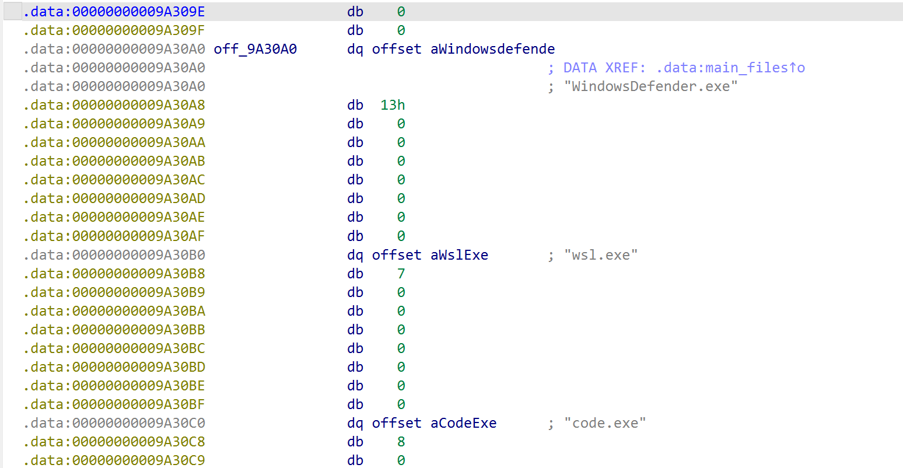

And we can find more http url
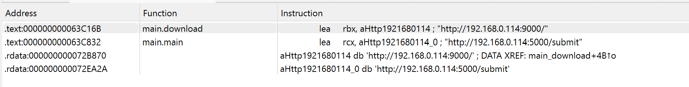

meaning that we just need to combine those to get the full url

## Question 18

```
We recovered all three binaries, you can find them here: https://drive.google.com/drive/folders/1PAQ80ksr_xoXZfSdU0SLOOgbYUmO2MiY?usp=sharing. What is the sha256 hash of the binaries
```

Just get the hash

## Question 19

```
What is the name of the first binary that would be executed
```

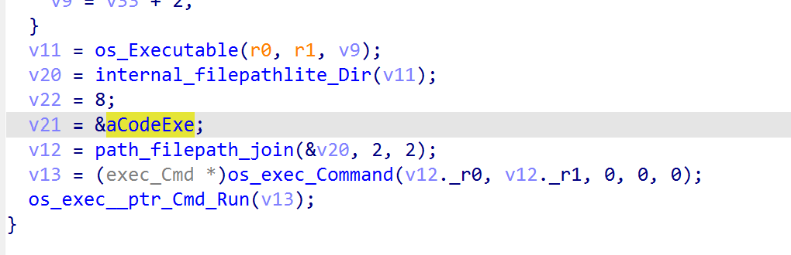

We can see that the first binary that would be run is code.exe

## Question 20

```
What technique did that binary use to elevate its permission
```

Now we enter the second hardest section. All 3 malwares have some anti-analysis setup:
1. Packing and virtualization using vmprotect
2. vmprotect's anti-debugger and anti-vm
3. Parent process checking

The intended solution is to do dynamic analysis, meaning we'll have to bypass all of them. Well, technically we can only bypass the anti-debugger and anti-vm, the parent process checking compares the hash of the parent process binary with a hardcoded value meaning if you want to bypass it, you'll have to hook the windows api call to return a false parent process path, and obviously its way too tedious to unpack and devirtualize vmprotect. There is also an unintended anti-analysis due to the way codex slopped the malware, if the ransomware failed to exfil the data, it would exit and not run the chain. In order to bypass it, simply make a vm using the ip and also setup an http server. I'll leave that as an exercise to the viewer.

So how can we bypass the anti-debugger and anti-vm. Well bypassing the anti-debugger is pretty simple, you can use x64dbg [scyllahide](https://github.com/x64dbg/scyllahide) plugin. For the anti-vm, the easiest way I found uses vmware, im not sure if other vm services have a similar bypass. We can follow the method on the very bottom of [this thread](https://www.unknowncheats.me/forum/general-programming-and-reversing/367629-vmprotect-3-anti-virtual-machine-check.html) to bypass the anti-vm. Now let's start doing dynamic analysis.

There are many tools that we can use for this dynamic analysis, but I'll choose procmon. To examine the binary put all 4 binaries in the `Public Music` directory, setup your http server so the ransomware could exfiltrate the data then simply run `AnyDesk.exe` while procmon is running

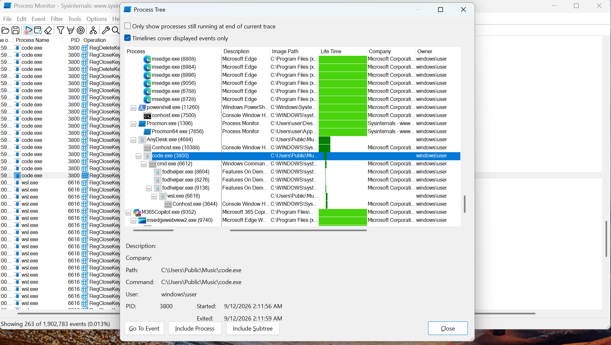

We can see that `code.exe` eventually runs `fodhelper.exe`, and fodhelper is a well known binary used for UAC Bypass or User Account Control Bypass so that's the answer


## Question 21

```
What is the MITRE ATT&CK id corresponding to that technique
```

A simple google search will give you `T1548.002`
## Question 22

```
What program did that binary use to make that technique work
```

We got that from our previous procmon analysis, `fodhelper.exe`

## Question 23

```
What command did that binary run
```

The way that fodhelper UAC works is by creating a registry key on `HKCU\Software\Classes\<random>\shell\open\command` so we can just filter for `RegCreateKey` and `RegSetValue` for that path and we'll see the command

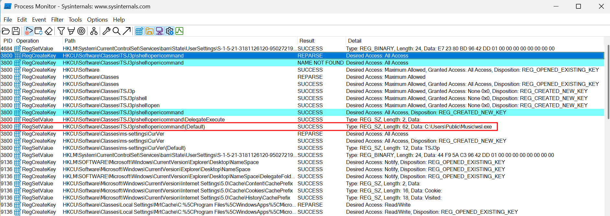

## Question 24

```
Which binary is responsible for setting up persistance
```

Here one could guess from the previous question that `wsl.exe` would be the answer, but we can also verify this on procmon.

If we filter for only registry operations from `wsl.exe`, we'll find these operations

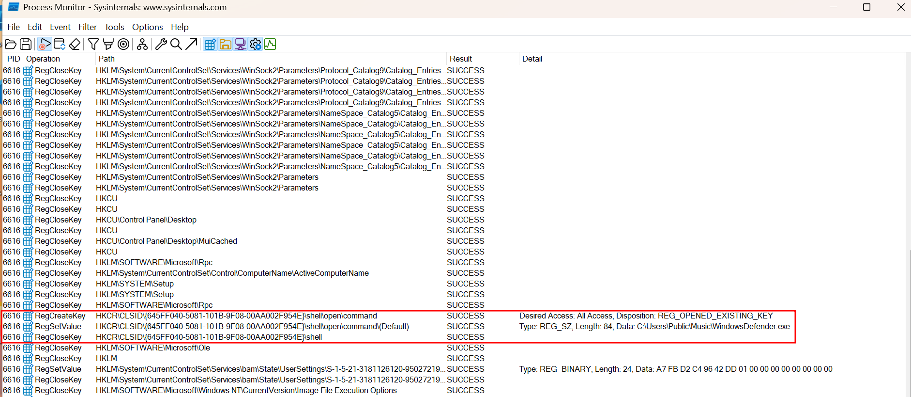

If you don't already know, these registry operations are done to setup persistance via the recycle bin (more about this method [here](https://github.com/vxunderground/VXUG-Papers/tree/main/The%20Persistence%20Series/Persistence%20via%20Recycle%20Bin)), solidifying our answer that indeed wsl.exe is the right answer.

## Question 25

```
What built-in windows program did the binary take advantage of for persistance
```
I've discussed this on the previous question, the answer is Recycle Bin

## Question 26
```
What binary will the persistance run
```

Also present on procomon, we see that its `WindowsDefender.exe`.

## Question 27

```
What technique does the malware use to execute shellcode
```

Alright let's try to run that binary and view it using procmon again.

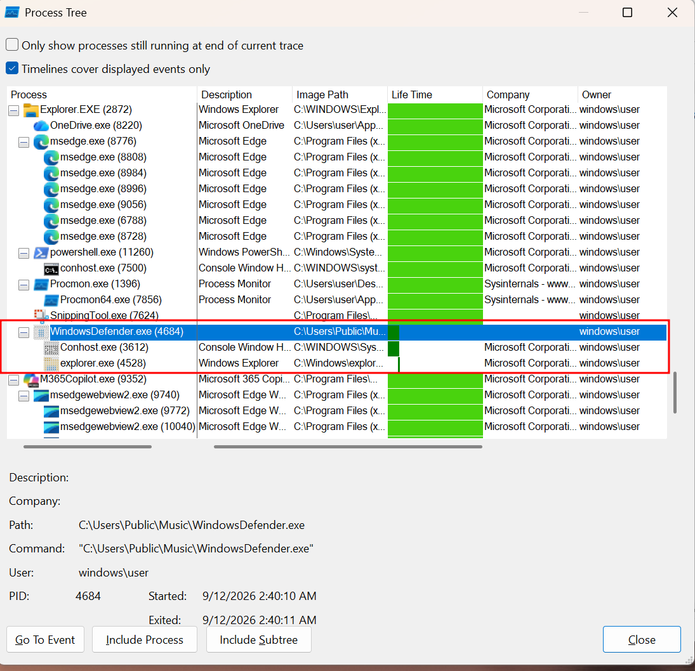

Here we see that it creates a `explorer.exe` process which is indicative of a common method used by malware called process hollowing.

## Question 28

```
Which program's process is used for that technique, provide the full path
```
Answered on the previous question as well, we can see the full path of the binary on the process tree.

## Question 29

```
What is the blake3 hash of the shellcode's hexdigest
```

To do this, I'll be running the program under x64dbg with the help of [DbgChild](https://github.com/therealdreg/DbgChild) plugin to automatically attach the debugger to any child process.

Once the debugger is attached to the child `explorer.exe` process, we can use the `modules` view to find the entry point and then follow it on the disassembler

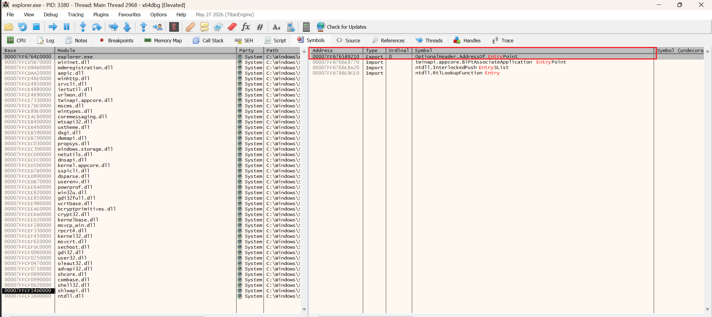

Where now you can see the shellcode

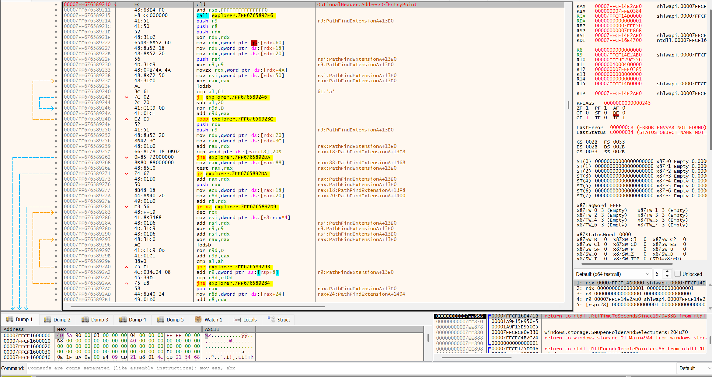

Just dump all the hex, put it into a python array, and then use python to get the hexdigest and the blake3 hash.

## Question 30

```
What is the ip and port that the shellcode is connecting to for the reverse shell
```

You can either get this by executing the shellcode then monitor the traffic using wireshark or just rev the shellcode. It's a standard meterpreter reverse tcp so it shouldnt be too hard to rev.


# Uninteded Path

During the competition, most people found a technically unintended path which you can use to solve question 22-26 without using procmon or any dynamic analysis. It's easy to unpack vmprotect, there are lots of tools to do them staticly on github or just run the binary then dump the process. Of course I know this, which is why I turned on the virtualization mode. However, it seems that after unpacking the strings aren't obfuscated meaning you can just get the answer to all those questions just by using strings cause they're all hardcoded. I was under the assumption that virtualization would at least obfuscate the strings, but ig I was wrong.


